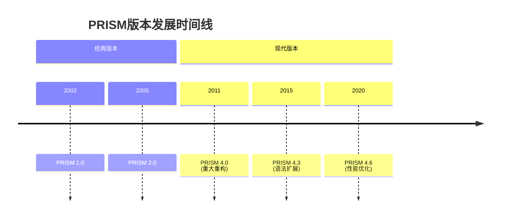

## 引言

PRISM（Probabilistic Symbolic Model Checker）是一个广泛使用的概率模型检测工具，用于分析随机系统的行为。随着时间推移，PRISM发布了多个版本，每个版本在功能、性能和语法支持上都有所不同。本指南将帮助初学者理解主要版本间的差异，并提供版本选择建议。

## 主要版本概览

PRISM的核心版本分为以下几个阶段：



## 关键差异比较

### 1. 语法支持

| 特性                | 4.0及以前 | 4.3+       | 4.6+       |
|---------------------|----------|------------|------------|
| 模块化常量定义      | 基本支持  | 增强型支持 | 完全支持   |
| 自定义函数          | 不支持    | 实验性支持 | 正式支持   |
| 多维数组            | 不支持    | 部分支持   | 完全支持   |

:::tip 示例：不同版本的常量定义
```prism
// PRISM 4.0 语法
const int N = 10; 

// PRISM 4.3+ 新增语法
const double PI = 3.1415926 module;
```
:::

### 2. 模型类型支持

- **4.0版本**：仅支持DTMC/CTMC/MDP
- **4.3版本**：引入POPTAs（概率时间自动机）
- **4.6版本**：优化POPTAs的性能

### 3. 性能对比

```mermaid
barChart
    title 模型检查速度比较(秒)
    x-axis 版本
    y-axis 时间
    series "小型模型"
        4.0: 5.2
        4.3: 4.8
        4.6: 3.1
    series "大型模型"
        4.0: 120
        4.3: 85
        4.6: 62
```

## 实际案例研究

### 案例：网络协议验证

假设我们需要验证一个重传协议的概率属性：

```prism
// PRISM 4.6特有语法示例
module Sender
    s : [0..3] init 0;
    [send] s=0 -> 0.9:(s'=1) + 0.1:(s'=2);
    [retry] s=2 -> 0.8:(s'=1) + 0.2:(s'=3);
endmodule
```

在PRISM 4.0中，相同的模型需要更冗长的写法，且不支持直接的概率表达式组合。

## 版本选择建议

1. **学习用途**：推荐最新稳定版（当前为4.6）
2. **兼容性需求**：若需与旧项目兼容，使用对应版本
3. **高级特性**：需要POPTAs时选择4.3+

:::warning 注意
某些教程可能基于旧版本编写，在新版本中语法可能略有不同
:::

## 总结

理解PRISM版本差异可以帮助您：

- 避免语法兼容性问题
- 充分利用最新功能
- 根据项目需求做出明智选择

## 延伸资源

1. 官方版本变更日志：[PRISM官网](https://www.prismmodelchecker.org)
2. 版本迁移指南（官方Wiki）
3. 交互式版本比较工具（PRISM扩展包）

## 练习

1. 在PRISM 4.6中尝试使用多维数组定义，然后在4.0版本中实现相同功能
2. 比较不同版本对同一模型的分析速度差异
3. 研究POPTAs在4.3和4.6中的语法差异