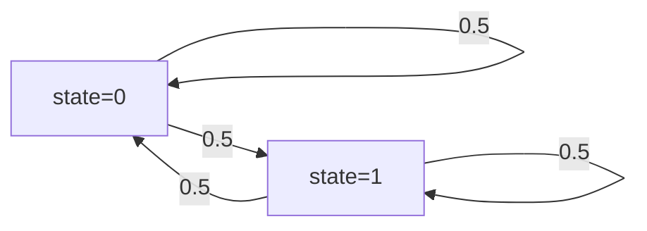

## 引言

PRISM是一个用于建模和分析概率系统的工具，广泛应用于协议验证、性能评估和随机算法设计。本节将引导你完成第一个PRISM模型的创建，涵盖基础语法、状态定义和简单属性验证。

## PRISM 模型基础结构

PRISM模型由**模块(module)**、**变量(variables)**和**命令(commands)**组成。以下是一个最小化的模型框架：

```prism
// 定义模型类型（DTMC/CTMC/MDP）
dtmc

// 模块定义
module Example
    // 变量声明（范围与初始值）
    x : [0..1] init 0;

    // 状态转移规则
    [] x=0 -> 0.5: (x'=0) + 0.5: (x'=1);
    [] x=1 -> 1: (x'=0);
endmodule
```

## 创建第一个模型：硬币抛掷

### 模型描述
模拟硬币抛掷过程：
- 初始状态：硬币为正面（head）
- 每次抛掷有50%概率保持当前状态或切换状态

### 完整代码
```prism
dtmc

module CoinFlip
    state : [0..1] init 0; // 0=heads, 1=tails

    // 状态转移规则
    [] state=0 -> 0.5 : (state'=0) + 0.5 : (state'=1);
    [] state=1 -> 0.5 : (state'=0) + 0.5 : (state'=1);
endmodule
```

### 模型解析
1. `dtmc` 声明模型类型为离散时间马尔可夫链
2. `state` 变量范围0到1，初始值为0
3. 转移规则：
   - `state=0`时：50%保持0，50%变为1
   - `state=1`时：对称转移



## 模型验证

添加属性验证检查长期运行中硬币处于正面的概率：

```prism
// 在模型文件末尾添加
label "heads" = state=0;

// 属性定义
P=? [ F "heads" ]
```

:::note 属性说明
- `P=?` 表示计算概率
- `F` 表示"最终满足"
- 该属性计算系统最终返回正面的概率
:::

## 实际案例：简单通信协议

模拟数据包传输成功率：
```prism
dtmc

module Protocol
    sent : bool init false;
    acked : bool init false;

    // 发送尝试（60%成功）
    [] !sent -> 0.6 : (sent'=true) + 0.4 : (sent'=false);
    
    // 确认接收（成功发送时80%概率）
    [] sent & !acked -> 0.8 : (acked'=true) + 0.2 : (acked'=false);
endmodule

// 验证传输成功率
P=? [ F acked ]
```

## 总结

通过本节你学会了：
1. PRISM模型的基本结构
2. 如何定义离散概率状态转移
3. 简单的概率属性验证方法

## 拓展练习
1. 修改硬币模型使其有60%概率保持当前状态
2. 为通信协议添加超时重传机制
3. 验证在10步内达到目标状态的概率

:::tip 下一步学习
建议继续学习[PRISM高级语法]和[奖励结构]相关内容
:::