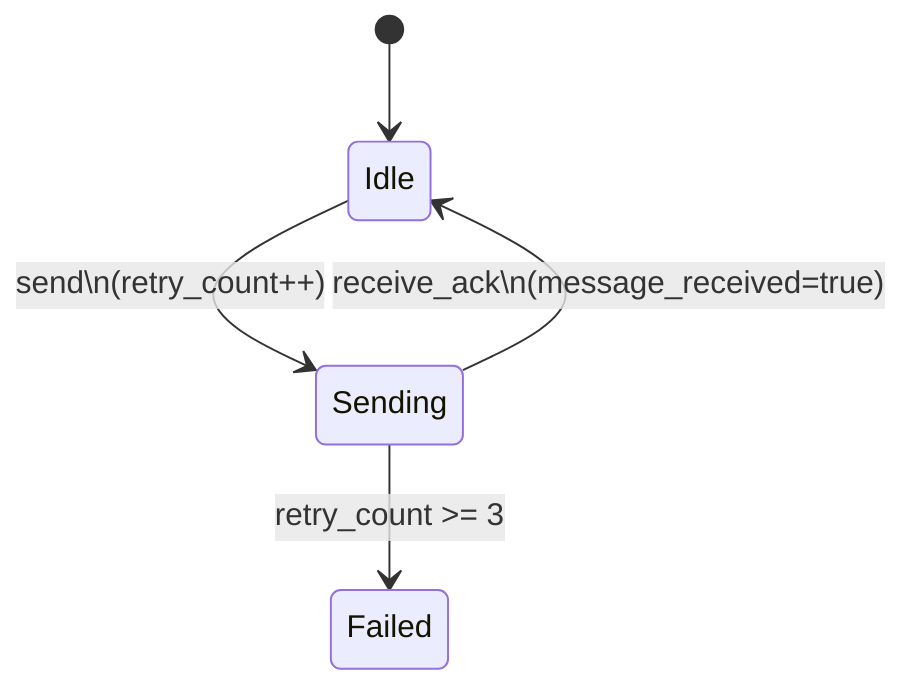

# PRISM 变量声明

## 介绍

在PRISM中，变量是构建概率模型的核心元素。它们用于表示系统状态、存储计算结果或定义模型参数。本节将详细介绍PRISM变量的声明方式、作用域规则以及常见使用模式。

## 基本语法

PRISM变量声明遵循以下基本结构：

```prism
<type> <name> [ init <value> ] [ <range> ];
```

其中：
- `<type>` 是变量类型（如 `int`, `bool` 等）
- `<name>` 是变量标识符
- `init` 是可选的初始值
- `<range>` 是可选的取值范围

### 变量类型

PRISM支持以下基本变量类型：

1. **布尔型**：
   ```prism
   bool flag;
   ```

2. **整型**：
   ```prism
   int counter [0..10]; // 带范围限制
   ```

3. **时钟变量**（用于时间自动机）：
   ```prism
   clock x;
   ```

:::note
变量名区分大小写且不能与PRISM关键字冲突。建议使用有意义的名称如 `packetReceived` 而非 `pr`。
:::

## 变量初始化

变量可以在声明时初始化：

```prism
bool active = true; 
int requests = 0;
```

或通过 `init` 关键字：

```prism
int queue_size init 5;
```

未显式初始化的变量会被赋予其类型的默认值（如 `false` 对于布尔型，`0` 对于整型）。

## 变量作用域

PRISM变量有两种作用域：

1. **全局变量**：在模型顶层声明，所有模块可见
   ```prism
   global int total_users; 
   ```

2. **局部变量**：在模块内声明，仅该模块可见
   ```prism
   module M1
     local int internal_counter;
   endmodule
   ```

## 实际示例

### 网络协议模型

考虑一个简单的重传协议模型：

```prism
// 全局状态变量
bool message_received init false;
int retry_count [0..3] init 0;

module Sender
    // 局部动作变量
    bool sending init false;
    
    [send] !sending & !message_received & retry_count < 3 -> 
        (sending' = true) & (retry_count' = retry_count + 1);
    
    [receive_ack] sending -> 
        (sending' = false) & (message_received' = true);
endmodule
```

### 状态转换图



## 高级特性

### 常量定义

虽然不是变量，但常量常与变量配合使用：

```prism
const int MAX_RETRIES = 3;
const double FAILURE_RATE = 0.1;
```

### 派生变量

基于其他变量的计算值：

```prism
formula queue_full = (queue_size >= MAX_QUEUE);
```

## 常见错误

:::caution
1. **范围溢出**：
   ```prism
   int x [0..5] init 6; // 错误：初始值超出范围
   ```

2. **类型不匹配**：
   ```prism
   bool b = 1; // 错误：PRISM中1不是布尔值
   ```

3. **重复声明**：
   ```prism
   int x;
   int x; // 错误：重复声明
   ```
:::

## 总结

PRISM变量声明是建模的基础，关键要点包括：
- 明确定义变量类型和范围
- 合理使用初始化值
- 区分全局和局部作用域
- 结合常量使用提高可读性

## 练习

1. 声明一个表示服务器状态的枚举变量，包含 `IDLE`, `BUSY`, `DOWN` 三种状态
2. 创建一个带有初始值的时钟变量用于超时检测
3. 设计一个公式变量计算队列使用率（当前大小/最大容量）

## 延伸阅读

- PRISM官方手册：变量声明章节
- 《概率模型检测》第三章：模型规范基础
- 案例研究：使用变量建模通信协议