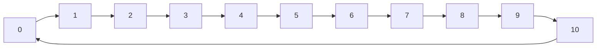

# PRISM 模块定义

## 介绍

在PRISM中，**模块(module)** 是构建模型的基本单元。每个模块包含一组变量和定义这些变量如何随时间演变的命令。理解模块定义是创建PRISM模型的第一步。本节将详细介绍PRISM模块的结构、语法和实际应用。

## 模块的基本结构

一个PRISM模块的基本结构如下：

```prism
module ModuleName
    // 变量声明
    v1 : [0..5] init 0;
    v2 : bool init false;

    // 命令
    [] v1 < 5 -> (v1' = v1 + 1);
    [] v2 = false -> (v2' = true);
endmodule
```

关键组成部分：
1. **模块声明**：以 `module ModuleName` 开始，以 `endmodule` 结束
2. **变量声明**：定义模块的局部变量及其初始值
3. **命令**：描述状态转换的规则

## 变量声明

模块中的变量有以下特点：
- 必须指定类型和取值范围
- 可以指定初始值(使用 `init`)
- 基本语法：`变量名 : 范围 init 初始值;`

示例：
```prism
// 布尔变量
active : bool init false;

// 有界整数变量(0到10)
count : [0..10] init 0;

// 枚举类型
state : {idle, active, failed} init idle;
```

:::tip
变量名区分大小写，建议使用有意义的名称提高可读性。
:::

## 命令语法

命令定义系统如何从一个状态转换到另一个状态，基本格式为：

```prism
[动作标签] 守卫条件 -> 更新规则;
```

- **动作标签**：可选，用于同步多个模块
- **守卫条件**：布尔表达式，决定命令何时可执行
- **更新规则**：描述变量如何更新(使用 `'` 表示下一状态的值)

示例：
```prism
// 简单命令
[] x < 10 -> (x' = x + 1);

// 带动作标签的命令
[send] ready -> (msg' = 1) & (ready' = false);

// 多分支更新
[] true -> 0.5: (x' = x+1) + 0.5: (x' = x-1);
```

## 实际案例：简单计数器

让我们通过一个简单的计数器模型演示模块定义：

```prism
module Counter
    count : [0..10] init 0;
    
    // 递增计数
    [] count < 10 -> (count' = count + 1);
    
    // 重置
    [] count = 10 -> (count' = 0);
endmodule
```

这个模型描述了一个从0数到10然后重置的计数器。在PRISM中模拟这个模型会生成一个有11个状态的马尔可夫链。



## 多模块系统

PRISM支持多个模块的交互。模块可以通过共享变量或同步动作进行通信。

```prism
module Module1
    x : [0..5] init 0;
    [sync] x < 5 -> (x' = x + 1);
endmodule

module Module2
    y : [0..5] init 5;
    [sync] y > 0 -> (y' = y - 1);
endmodule
```

在这个例子中，两个模块通过 `sync` 动作标签同步执行。

## 总结

- 模块是PRISM模型的基本构建块
- 每个模块包含变量声明和命令
- 变量有明确的类型和初始值
- 命令定义状态转换规则
- 多模块系统可以通过共享变量或同步动作交互

## 练习与扩展

1. 创建一个模块模拟一个三状态(红、黄、绿)的交通灯
2. 扩展计数器示例，添加一个暂停功能
3. 设计两个交互模块模拟生产者和消费者关系

:::note 附加资源
- PRISM官方文档: [模块定义部分](https://www.prismmodelchecker.org/manual/ThePRISMLanguage/ModulesAndVariables)
- 《Principles of Model Checking》第10章
:::