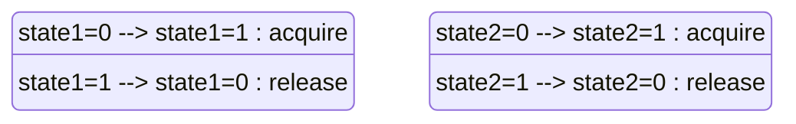

# PRISM 同步构造

## 简介

在PRISM模型中，**同步构造（Synchronisation）**是实现多个模块间协调行为的关键机制。它允许不同模块的变迁（transitions）在特定条件下同时触发，模拟真实系统中的并发事件（如协议交互或分布式算法）。本节将逐步讲解同步构造的语法、语义及实际应用。

---

## 基本概念

### 同步标签（Synchronisation Labels）
PRISM通过**同步标签**实现模块间同步。当一个变迁被标记为同步时，所有共享该标签的模块必须**同时执行**对应的变迁（除非明确设置为非同步行为）。

#### 语法规则：
```prism
[<label>] <guard> -> <updates>;
```
- `label`：同步标签名称（如`sync`）
- `guard`：触发条件（如`x > 0`）
- `updates`：状态更新（如`x'=x+1`）

:::note
同步标签是全局的，所有模块中同名的标签会自动关联。
:::

---

## 代码示例

### 示例1：简单同步
以下模型展示两个模块通过标签`sync`同步递增计数器：

```prism
// 模块1
module Module1
    x : [0..10] init 0;
    [sync] x < 10 -> (x' = x + 1);
endmodule

// 模块2
module Module2
    y : [0..10] init 0;
    [sync] y < 10 -> (y' = y + 1);
endmodule
```

**行为解释**：
1. 当`x < 10`且`y < 10`时，两个模块同时执行变迁。
2. 若任一条件不满足（如`x=10`），同步无法发生。

---

### 示例2：带权重的同步
PRISM允许为同步行为分配概率权重：

```prism
module Module3
    z : bool init false;
    [activate] true -> 0.8 : (z'=true) + 0.2 : (z'=false);
endmodule

module Module4
    [activate] true -> 1.0 : skip;
endmodule
```

**输出效果**：
- `Module3`有80%概率将`z`设为`true`，20%概率设为`false`。
- `Module4`的变迁必须同步执行，但不改变自身状态（`skip`）。

---

## 实际应用场景

### 案例：互斥锁（Mutex）
使用同步构造模拟两个进程竞争锁资源：

```prism
const int N = 2; // 进程数量
global lock : [0..N] init 0; // 0=未锁定, 1/2=被进程1/2占用

module Process1
    state1 : [0..1]; // 0=等待, 1=临界区
    [acquire] state1=0 & lock=0 -> (state1'=1) & (lock'=1);
    [release] state1=1 -> (state1'=0) & (lock'=0);
endmodule

module Process2
    state2 : [0..1];
    [acquire] state2=0 & lock=0 -> (state2'=1) & (lock'=2);
    [release] state2=1 -> (state2'=0) & (lock'=0);
endmodule
```



**关键点**：
- `acquire`标签确保同一时间只有一个进程能进入临界区。
- `lock`变量避免资源冲突。

:::caution
实际建模时需额外处理死锁风险（如超时机制）。
:::

---

## 总结

1. **同步构造**是PRISM中协调多模块行为的核心机制。
2. 通过**同步标签**声明需要联合触发的变迁。
3. 支持概率权重分配，适用于随机化系统建模。
4. 典型应用包括并发控制、协议验证等。

---

## 扩展练习

1. 修改互斥锁案例，增加第三个进程并观察行为变化。
2. 尝试用同步构造实现一个简单的**生产者-消费者**模型。
3. 为同步变迁添加时间延迟（使用`PTA`语法）。

:::tip
在PRISM GUI中通过「Simulator」功能实时跟踪同步行为！
:::