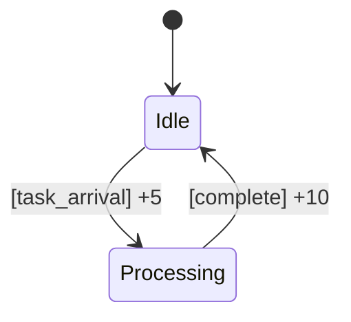

# PRISM 奖励结构

## 介绍

在概率模型检测中，**奖励结构（Reward Structures）**用于量化系统的特定行为或状态。通过为状态或转移分配数值（"奖励"或"成本"），我们可以分析诸如"系统在故障前平均运行时间"或"完成任务的平均能耗"等问题。PRISM支持两种奖励类型：
- **状态奖励（State Rewards）**：基于系统保持在某状态的时长
- **转移奖励（Transition Rewards）**：基于特定状态转移的发生

## 基本语法

PRISM中奖励结构通过`rewards`和`endrewards`块定义：

```prism
rewards "reward_name"
    [guard] : reward_expression;
endrewards
```

### 示例1：状态奖励
```prism
rewards "time_elapsed"
    state=working : 1;
endrewards
```
这表示系统每在`working`状态停留1个时间单位，累计1点奖励。

### 示例2：转移奖励
```prism
rewards "energy_used"
    [action] x>0 : x;
endrewards
```
当`action`发生且`x>0`时，奖励值增加`x`（例如表示能耗）。

## 奖励类型详解

### 1. 状态奖励
适用于连续时间模型（CTMC），计算方式为：
```
总奖励 = 奖励率 × 停留时间
```

:::note 实际案例：服务器集群
```prism
rewards "uptime"
    server1=active & server2=active : 2;  // 双机运行奖励更高
    server1=active | server2=active : 1;  // 单机运行
endrewards
```
:::

### 2. 转移奖励
适用于所有模型类型，在状态转移时立即获得：



对应的PRISM代码：
```prism
rewards "task_rewards"
    [task_arrival] true : 5;
    [complete] true : 10;
endrewards
```

## 复合奖励结构

可以组合多个奖励指标：

```prism
rewards "energy_time_tradeoff"
    [activate] : 3;          // 激活耗能
    state=active : 0.5;      // 运行能耗
    [shutdown] : -1;         // 关机回收
endrewards
```

:::tip 设计建议
1. 为每个奖励结构赋予语义化名称
2. 复杂系统可分解为多个奖励结构
3. 使用注释说明奖励的单位和含义
:::

## 实际应用案例

### 案例：云计算成本分析
```prism
rewards "monetary_cost"
    // VM运行成本（$/小时）
    vm_state=running : 0.15;
    
    // 数据传输成本
    [data_transfer] size>0 : size*0.01;
    
    // 惩罚：SLA违规
    [sla_violation] : 50;
endrewards
```

通过模型检测可以查询：
- `R{"monetary_cost"}=? [ C<=T ]`：T时间内预期成本
- `R{"monetary_cost"}=? [ F completed ]`：完成任务的平均成本

## 总结与练习

### 关键点总结
1. 奖励结构量化系统行为的特定方面
2. 状态奖励与时间相关，转移奖励与动作相关
3. 支持复杂的逻辑表达式定义奖励条件
4. 可组合多个奖励结构进行多维分析

### 练习建议
1. 为简单的交通灯模型添加"等待时间"奖励
2. 修改云计算的案例，添加闲置资源回收奖励
3. 尝试查询不同时间范围内的累计奖励

### 扩展学习
- PRISM官方文档：Reward Structures章节
- 《Principles of Model Checking》第10章
- 进阶：时态逻辑与奖励结合（PCTL*）