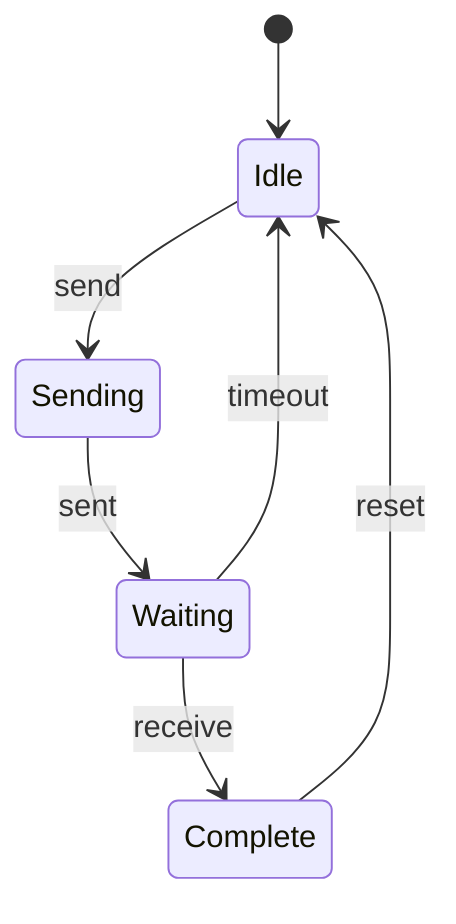

# PRISM 模块组合

## 介绍

在PRISM中，**模块组合**是构建复杂概率模型的核心机制。通过将多个简单模块组合成一个完整系统，您可以描述并发进程间的交互行为。PRISM支持两种组合方式：
- **异步组合**：模块独立执行
- **同步组合**：模块通过共享动作同步执行

## 基本语法结构

PRISM模型由多个模块组成，每个模块用`module...endmodule`定义。全局变量在所有模块间共享：

```prism
// 全局变量声明
global_var: [0..5] init 0;

module Module1
    local_var1: [0..1] init 0;
    [action] guard -> rate : (update);
endmodule

module Module2
    [action] guard -> rate : (update);
endmodule
```

## 同步组合示例

当多个模块共享相同动作标签时，它们会同步执行。下面是一个经典的"生产者-消费者"模型：

```prism
module Producer
    produce: bool init false;
    [produce] !produce -> 0.5: (produce'=true);
    [consume] produce -> 1: (produce'=false);
endmodule

module Consumer
    [consume] true -> 1;
endmodule
```

:::note 同步规则
1. 所有包含该动作的模块必须满足guard条件
2. 系统整体转移率是各模块转移率的乘积
3. 状态更新是所有模块更新的联合
:::

## 异步组合示例

不共享动作的模块会异步执行。这个例子展示两个独立运行的进程：

```prism
module Process1
    state1: [0..2] init 0;
    [step1] state1<2 -> 2.0 : (state1'=state1+1);
endmodule

module Process2
    state2: [0..1] init 0;
    [step2] true -> 1.5 : (state2'=1-state2);
endmodule
```

## 实际案例：网络协议建模

让我们用模块组合建模简单的重传协议：

```prism
module Sender
    sent: bool init false;
    ack: bool init false;
    
    [send] !sent -> 1.0 : (sent'=true);
    [receive] sent & !ack -> 0.9 : (ack'=true);
    [timeout] sent & !ack -> 0.1 : (sent'=false);
    [reset] true -> 1.0 : (sent'=false; ack'=false);
endmodule

module Receiver
    [receive] true -> 1.0;
    [reset] true -> 1.0;
endmodule
```



## 组合语义详解

PRISM采用**并行组合**语义，系统状态空间是各模块状态的笛卡尔积。转移关系由以下规则决定：

1. **异步转移**：单个模块独立执行动作
   - 转移率 = 该模块的转移率
   - 其他模块状态不变

2. **同步转移**：所有包含该动作的模块同时执行
   - 转移率 = 各模块转移率的乘积
   - 所有模块状态同时更新

:::warning 死锁风险
如果某模块的guard条件不满足，同步动作将无法执行。设计模型时需确保合理的guard条件组合。
:::

## 总结与练习

**关键知识点**：
- 模块通过共享动作实现同步
- 异步执行时各模块独立演进
- 全局变量在所有模块间共享
- 局部变量只在声明模块内可见

**练习建议**：
1. 扩展生产者-消费者模型，增加第二个消费者模块
2. 创建三个模块的互斥协议，使用同步动作实现锁机制
3. 修改网络协议模型，增加数据包丢失概率

**延伸阅读**：
- PRISM手册第4章"Building Models"
- 《概率模型检测》第3.2节模块化建模
- 并发系统建模中的组合语义