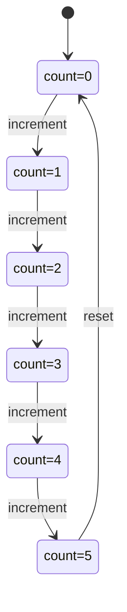

# PRISM 变量类型与范围

## 介绍

在PRISM建模语言中，变量是构建模型的核心元素之一。变量用于表示系统的状态、存储中间计算结果或定义模型参数。理解PRISM支持的变量类型及其作用范围，是编写正确、高效模型的基础。本章将详细介绍PRISM中的变量类型、声明方式以及它们的作用范围规则。

## 变量类型

PRISM支持以下几种基本变量类型：

### 1. 整数类型 (int)
最常用的变量类型，表示有符号整数。范围取决于具体实现，但通常足够大以满足建模需求。

```prism
// 声明一个整数变量
x : [0..10] init 0;  // 范围0-10，初始值为0
```

### 2. 布尔类型 (bool)
表示真/假值，实际上是整数0(false)和1(true)的语法糖。

```prism
// 声明布尔变量
flag : bool init false;  // 等价于 [0..1] init 0
```

### 3. 时钟类型 (clock)
用于时间自动机模型，表示连续时间变量。

```prism
// 声明时钟变量
clock x;  // 不需要初始值，自动从0开始
```

:::note
时钟变量只能用于PTA(Probabilistic Timed Automata)模型中，且需要特殊语法处理。
:::

## 变量范围

### 1. 全局变量
在模型最外层声明的变量，对整个模型可见。

```prism
// 全局变量示例
global_var : [0..100] init 50;

module M1
    // 可以访问global_var
    [] true -> (global_var' = global_var + 1);
endmodule
```

### 2. 模块局部变量
在模块内部声明的变量，只对该模块可见。

```prism
module M2
    local_var : bool init false;
    [] !local_var -> (local_var' = true);
endmodule

// 其他模块不能访问local_var
```

### 3. 常量 (const)
使用`const`关键字定义的不可变值，必须在声明时初始化。

```prism
const int MAX_SIZE = 100;  // 常量声明
```

## 变量声明语法

PRISM变量声明的一般语法为：

```
<name> : [<min>..<max>] init <value>;
```

其中：
- `<name>` 是变量名
- `[<min>..<max>]` 定义变量取值范围
- `init <value>` 设置初始值

:::caution
变量名区分大小写且不能与PRISM关键字冲突。
:::

## 实际案例

### 简单计数器模型

```prism
// 全局常量定义
const int MAX_COUNT = 5;

// 全局变量
count : [0..MAX_COUNT] init 0;

module Counter
    // 模块局部变量
    active : bool init true;
    
    [increment] active & count < MAX_COUNT -> 
        (count' = count + 1) & (active' = (count' < MAX_COUNT));
    
    [reset] !active -> 
        (count' = 0) & (active' = true);
endmodule
```

### 状态转换图表示



## 最佳实践

1. **合理限定范围**：始终为变量指定最小和最大范围，避免状态空间爆炸。
2. **初始化变量**：明确设置初始值，避免不确定行为。
3. **使用常量**：对于固定值，使用`const`而非变量。
4. **模块化设计**：将相关变量放在同一模块中，提高可读性。

## 常见错误

```prism
// 错误1：未指定范围
x init 0;  // 错误：必须指定范围

// 错误2：范围无效
y : [10..5] init 6;  // 错误：最小值大于最大值

// 错误3：初始值超出范围
z : [0..10] init 11;  // 错误：初始值不在范围内
```

## 总结

PRISM中的变量系统提供了灵活的建模能力，关键要点包括：
- 支持整数、布尔和时钟三种基本类型
- 变量可以是全局或模块局部的
- 必须明确指定范围和初始值
- 常量使用`const`关键字定义

掌握这些基础知识后，你将能够正确定义变量来构建各种概率模型。

## 延伸学习

1. 尝试修改计数器示例，添加递减功能
2. 创建一个包含多个模块的模型，测试变量作用范围
3. 研究时钟变量在PTA模型中的特殊行为

:::tip 练习
创建一个简单的交通灯模型，使用布尔变量表示红/绿/黄灯状态，并定义状态转换规则。
:::