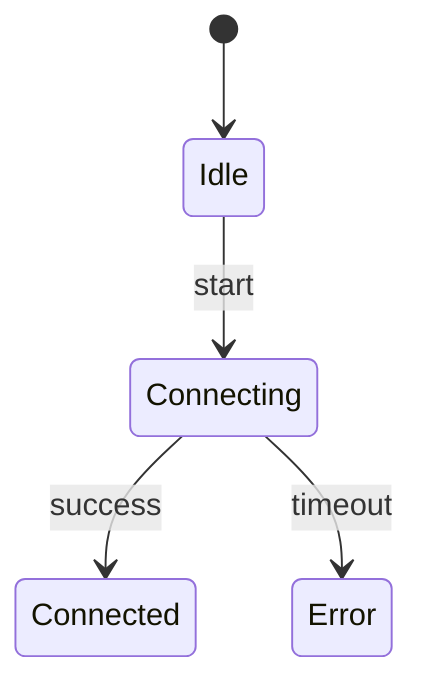

# PRISM 初始状态定义

## 介绍

在PRISM概率模型检测工具中，**初始状态定义**是模型构建的关键环节。它决定了系统在时间起点（t=0）时的变量取值和整体状态，直接影响后续的状态转移和验证结果。本文将详细讲解PRISM中定义初始状态的语法规范、常见模式以及实际应用技巧。

## 基本语法

PRISM通过`init`模块定义初始状态，语法结构如下：

```prism
init
    [初始条件]
endinit
```

其中`[初始条件]`可以是：
- 单个布尔表达式
- 多个用`&`连接的表达式
- 概率分布表达式

### 简单示例

```prism
// 定义布尔变量x和整型变量y
module M
    x : bool;
    y : [0..3];
    
    // 初始状态定义
    init
        x = true & y = 0
    endinit
    
    // 转移规则...
endmodule
```

:::note 重要说明
初始条件必须满足：
1. 所有变量都有明确定义的值
2. 不违反任何类型范围约束
3. 对于概率模型，初始分布的总概率必须为1
:::

## 定义方式详解

### 1. 确定性初始状态

最常见的形式是明确指定每个变量的初始值：

```prism
init
    (x = 2) & (y = false) & (z = "ready")
endinit
```

### 2. 概率性初始状态

对于概率模型（如MDP或DTMC），可以使用概率分布：

```prism
init
    // 50%概率x=0，50%概率x=1
    x=0 : 0.5 & x=1 : 0.5
endinit
```

### 3. 条件初始状态

通过`true`作为默认条件，可以创建灵活的初始化：

```prism
init
    // 如果满足cond则x=1，否则x=0
    (cond -> x=1) & (!cond -> x=0)
endinit
```

## 实际案例

### 案例1：简单库存系统

```prism
module Inventory
    stock : [0..10];
    reordering : bool;
    
    init
        stock = 5 & reordering = false
    endinit
    
    // 当库存≤2时开始补货
    [restock] stock <= 2 -> (reordering' = true);
endmodule
```

### 案例2：网络协议状态机



对应的PRISM初始化：

```prism
module Protocol
    state : [0..2]; // 0=Idle, 1=Connecting, 2=Connected
    
    init
        state = 0 // 初始为Idle状态
    endinit
endmodule
```

## 常见错误与调试

:::caution 典型错误
1. **未初始化变量**：
   ```prism
   init
       x = 1 // y未初始化
   endinit
   ```

2. **概率总和不为1**：
   ```prism
   init
       x=0 : 0.3 & x=1 : 0.6 // 总和0.9≠1
   endinit
   ```

3. **超出取值范围**：
   ```prism
   init
       y = 4 // 但y定义为[0..3]
   endinit
   ```
:::

## 总结与练习

### 关键要点
- 所有变量必须在`init`块中初始化
- 确定性模型使用明确赋值
- 概率模型需保证概率分布有效
- 初始状态应反映系统的真实起点

### 巩固练习
1. 为交通灯系统定义初始状态（红/黄/绿三状态）
2. 创建一个有30%概率处于"休眠"状态的设备模型
3. 调试以下错误初始化：
   ```prism
   module Test
       a : bool;
       b : [1..5];
       init
           a = true
       endinit
   endmodule
   ```

### 扩展阅读
- PRISM官方文档《Model Construction》章节
- 《Principles of Model Checking》第10章
- 状态空间初始化最佳实践论文

通过掌握初始状态定义，您已经为构建准确的PRISM模型奠定了重要基础！