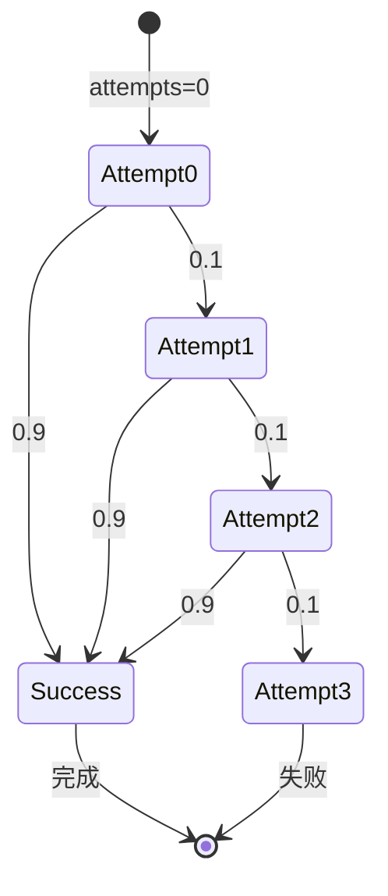

# PRISM 概率转移

## 介绍

概率转移是PRISM模型中的核心概念，它描述了系统从一个状态转移到另一个状态的概率。在概率模型（如离散时间马尔可夫链（DTMC）或马尔可夫决策过程（MDP））中，概率转移定义了系统行为的不确定性。理解概率转移是构建和分析PRISM模型的基础。

## 基本语法

在PRISM中，概率转移通过`[]`内的守卫条件和`->`后的转移动作定义。基本语法如下：

```prism
[action] guard -> p1 : (state1') + p2 : (state2') + ... + pn : (staten');
```

- **action**（可选）：触发转移的动作名称。
- **guard**：布尔表达式，决定转移是否可执行。
- **p1, p2, ..., pn**：转移概率（必须满足总和为1）。
- **state1', state2', ..., staten'**：转移后的目标状态。

### 示例：简单的DTMC模型

以下是一个包含概率转移的DTMC模型，模拟天气变化：

```prism
dtmc

module Weather
  state : [0..2] init 0; // 0=Sunny, 1=Cloudy, 2=Rainy

  [] state=0 -> 0.7 : (state'=0) + 0.2 : (state'=1) + 0.1 : (state'=2);
  [] state=1 -> 0.3 : (state'=0) + 0.4 : (state'=1) + 0.3 : (state'=2);
  [] state=2 -> 0.2 : (state'=0) + 0.3 : (state'=1) + 0.5 : (state'=2);
endmodule
```

**解释**：
- 当`state=0`（晴天）时，有70%概率保持晴天，20%转为多云，10%转为雨天。
- 其他状态的转移逻辑类似。

## 概率转移的规范化

PRISM要求所有转移概率的总和必须为1（即完全概率分布）。如果未满足，PRISM会报错。例如：

```prism
// 错误示例：概率总和不为1
[] state=0 -> 0.6 : (state'=0) + 0.3 : (state'=1); // 总和=0.9
```

:::caution
PRISM会拒绝概率总和不为1的模型。如果希望允许“不完整”的转移（如终止），需显式添加自环概率。
:::

## 实际案例：网络协议重传

考虑一个网络协议模型，数据包以概率`p`成功发送，失败时重传：

```prism
dtmc

module Protocol
  sent : bool init false;
  attempts : [0..3] init 0; // 最多重试3次

  [] !sent & attempts<3 -> 0.9 : (sent'=true) + 0.1 : (attempts'=attempts+1);
  [] sent -> (sent'=true); // 保持成功状态
endmodule
```

**Mermaid状态图**：


## 高级用法：带动作的MDP

在MDP中，概率转移可能依赖于非确定性选择。例如，一个机器人选择不同路径：

```prism
mdp

module Robot
  x : [0..2] init 0;
  [move_A] x=0 -> 0.8 : (x'=1) + 0.2 : (x'=2);
  [move_B] x=0 -> 0.5 : (x'=1) + 0.5 : (x'=2);
endmodule
```

**解释**：
- 动作`move_A`和`move_B`代表两种策略，PRISM将分析最优选择。

## 总结

- 概率转移是PRISM模型的核心，定义状态间的随机迁移。
- 语法需严格满足概率规范化（总和为1）。
- 通过DTMC和MDP可分别建模纯概率和带非确定性的系统。

## 练习
1. 修改天气模型，增加“雪天”状态及其转移概率。
2. 为网络协议模型添加超时机制（如超过3次尝试后重置）。

## 扩展阅读
- PRISM官方文档：[概率模型语法](https://www.prismmodelchecker.org/manual/ThePRISMLanguage/ModelFiles)
- 《Principles of Model Checking》：第10章（概率系统验证）