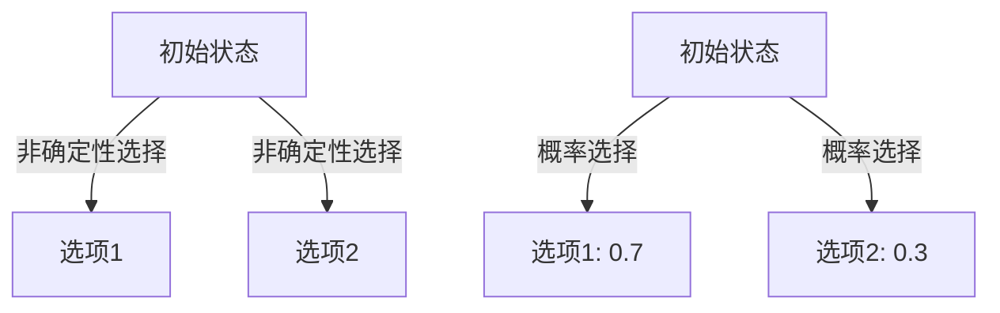

# PRISM 非确定性选择

## 介绍

在PRISM模型中，**非确定性选择（Nondeterministic Choice）**是描述系统行为不确定性的核心机制。它表示系统在某个状态下可能有多种可能的动作或转移，但具体选择哪一个不是由概率决定的（与概率选择不同），而是由外部因素（如环境或调度器）决定。这种特性在建模并发系统、协议验证或控制器设计时尤为重要。

非确定性选择通常用 `[]` 符号表示，语法形式为：
```prism
[action] guard -> update;
```

其中：
- `action`（可选）：动作标签
- `guard`：触发转移的条件
- `update`：状态转移的表达式

## 基础语法

### 简单非确定性选择
以下模型展示了一个最简单的非确定性选择，系统每次可以选择将 `x` 加1或减1：

```prism
module Example
  x : [0..10] init 0;

  [] x < 10 -> (x'=x+1);
  [] x > 0  -> (x'=x-1);
endmodule
```

:::note 注意
- 当多个守卫条件（`guard`）同时为真时，PRISM会非确定性地选择其中一条执行
- 如果没有动作标签（`action`），则称为"匿名命令"
:::

### 带动作标签的示例
动作标签可以用于同步多个模块：

```prism
module M1
  [send] true -> (x'=x+1);
endmodule

module M2
  [send] true -> (y'=y-1);
endmodule
```
当 `M1` 和 `M2` 同时执行 `send` 动作时，两个模块的状态会同步更新。

## 非确定性与概率选择的区别

理解非确定性选择与概率选择的区别至关重要：



关键区别：
1. **概率选择**：每个选项有明确的概率分布
2. **非确定性选择**：没有预设概率，所有有效选项都可能被选择

## 实际应用案例

### 并发系统调度
考虑一个简单的任务调度系统，两个进程竞争资源：

```prism
module Process1
  state1 : [0..1]; // 0=idle, 1=active
  [activate] state1=0 -> (state1'=1);
  [finish] state1=1 -> (state1'=0);
endmodule

module Process2
  state2 : [0..1]; // 0=idle, 1=active
  [activate] state2=0 -> (state2'=1);
  [finish] state2=1 -> (state2'=0);
endmodule
```

系统可能的执行顺序：
1. Process1先激活，然后Process2
2. Process2先激活，然后Process1
3. 两者同时激活（如果模型允许）

### 网络协议建模
在协议验证中，非确定性可以表示消息丢失：

```prism
module Sender
  msg_sent : bool;
  [send] !msg_sent -> (msg_sent'=true);
endmodule

module Channel
  msg_delivered : bool;
  [] sender.msg_sent & !msg_delivered -> 0.9 : (msg_delivered'=true) + 0.1 : true;
endmodule
```

:::tip 实际应用
非确定性选择常用于：
- 建模未知环境行为
- 抽象化复杂子系统
- 验证系统在所有可能情况下的正确性
:::

## 高级主题：非确定性循环

非确定性选择常导致无限可能的状态序列。例如这个经典的非确定性循环：

```prism
module LoopExample
  x : [0..3] init 0;
  
  [] x=0 -> (x'=1);
  [] x=0 -> (x'=2);
  [] x=1 -> (x'=3);
  [] x=2 -> (x'=3);
  [] x=3 -> (x'=0);
endmodule
```

可能的状态序列：
1. 0→1→3→0→...
2. 0→2→3→0→...
3. 交替选择两条初始路径

## 总结

- 非确定性选择用 `[]` 表示，是建模不确定行为的强大工具
- 与概率选择不同，它不指定各选项的概率分布
- 常用于并发系统、协议验证和控制器设计
- 动作标签可以实现模块间同步
- PRISM分析时会考虑所有可能的非确定性选择

## 练习与扩展

1. 修改第一个示例，使 `x` 在达到边界时重置为0
2. 创建一个包含3个进程的资源竞争模型
3. 尝试为网络协议示例添加超时重传机制

推荐进一步学习：
- PRISM官方文档中的"Non-determinism"章节
- 《Principles of Model Checking》第10章
- 并发系统建模案例研究