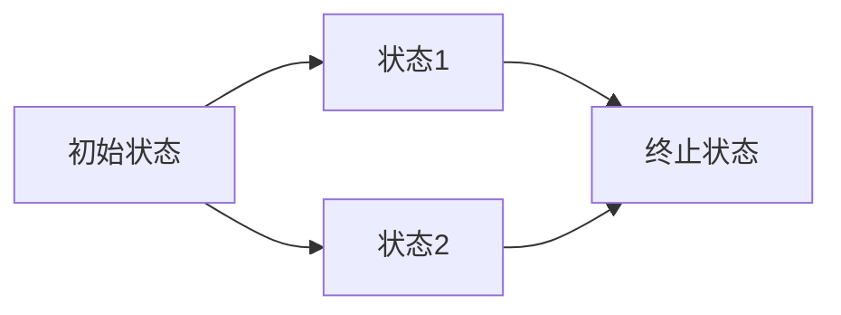

# PRISM 模型调试技术

## 介绍
PRISM是一个用于分析概率系统的形式化验证工具。在构建复杂模型时，调试是确保模型正确性的关键步骤。本章将介绍PRISM模型调试的核心技术，包括语法检查、语义验证和性能分析。

## 基础调试技术

### 1. 语法检查
PRISM模型文件（`.prism`扩展名）的常见语法错误包括：
- 缺少分号或括号
- 未定义的变量或常量
- 类型不匹配

```prism
// 错误示例：缺少分号
const int N = 5  // 这里应该加分号
module M
    x : [0..N] init 0;
endmodule
```

运行时会显示类似错误：
```
Error: Expected ";" at line 2, column 15.
```

### 2. 模型验证
使用 `-sim` 参数进行模拟运行，验证模型行为：

```bash
prism model.prism -sim -simsamples 100
```

## 高级调试方法

### 1. 状态空间分析
检查模型的可达状态是否符合预期：



### 2. 属性验证
通过临时添加 `label` 标记关键状态：

```prism
label "safe" = x < 10;
```

然后验证属性：
```prism
P=? [ F "safe" ]
```

## 实际案例研究

### 案例：通信协议超时机制
调试一个无线传感器网络的重传模型：

```prism
module Sensor
    attempts : [0..3] init 0;
    [] attempts < 3 -> 0.9: (attempts'=attempts+1) + 0.1: (attempts'=0);
endmodule
```

常见问题：
1. 概率总和不为1（修正为 `0.9 + 0.1`）
2. 缺少终止条件（添加 `attempts=3` 时的行为）

## 性能优化技巧

:::tip 性能提示
对大型模型：
1. 使用 `const` 而非 `formula` 减少计算量
2. 分模块验证复杂系统
3. 启用 `-exact` 选项消除浮点误差
:::

```prism
// 优化前
formula retry_limit = max_retries/2;

// 优化后
const int retry_limit = 5;  // 预计算常量
```

## 总结与练习

### 关键要点
1. 始终从语法检查开始
2. 使用模拟验证基础行为
3. 分阶段构建复杂模型
4. 合理使用标签进行状态追踪

### 练习任务
1. 创建一个有意的语法错误模型，观察PRISM的错误提示
2. 为简单队列模型添加 `label` 标记满/空状态
3. 比较 `-exact` 和默认模式下的计算结果差异

## 扩展资源
- PRISM官方文档：调试章节
- 《形式化方法实践》第7章
- 模型检查研讨会（TACAS）案例集