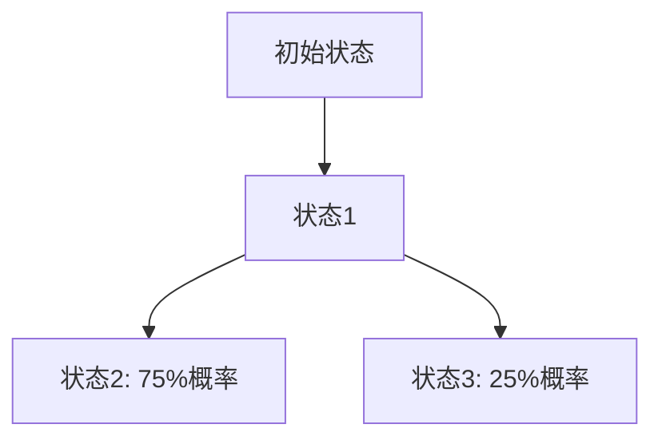

# PRISM 日志分析

## 介绍

PRISM（Probabilistic Symbolic Model Checker）是一个广泛使用的概率模型检测工具，用于验证随机系统的属性。在运行PRISM模型时，生成的日志文件包含关键信息，如模型构建细节、状态空间统计和验证结果。分析这些日志能帮助开发者定位性能瓶颈、调试模型错误，并优化验证流程。

## 日志文件结构

PRISM日志通常包含以下部分：

1. **模型加载信息**：显示加载的模型文件和解析状态。
2. **状态空间统计**：包括状态数、转换数和构建时间。
3. **属性验证结果**：每个验证属性的输出（概率/期望值）。
4. **性能指标**：内存使用和计算时间。

示例日志片段：
```text
PRISM: Loading model from "example.prism"...
Model states: 1,024
Transitions: 4,096
Time for model construction: 2.3 seconds
Property "P=? [F success]": 0.875
```

## 关键日志分析方法

### 1. 识别错误和警告
搜索日志中的 `error` 或 `warning` 关键词：
```text
WARNING: Division by zero in expression (line 5)
ERROR: Unreachable state detected in module "Controller"
```

### 2. 状态空间分析
检查状态数和转换数是否与预期一致。异常增长可能表示模型定义错误：
```text
Model states: 1,048,576  # 可能遭遇状态爆炸
Transitions: 16,777,216
```

### 3. 性能优化
比较不同参数下的构建时间：
```text
Time for model construction (default): 10.2s
Time with symmetry reduction: 1.8s  # 显著优化
```

## 实际案例

### 案例：通信协议超时分析
分析以下日志片段，发现状态空间过大导致验证超时：
```text
Building model... (may take several minutes)
States: 2,097,152   # 状态数超过200万
Transitions: 16,777,216
Verification timed out after 1 hour.
```

**解决方案**：通过添加抽象或使用 `-const` 参数限制变量范围：
```bash
prism protocol.prism -const "MAX_RETRIES=3"
```

## 高级技巧

### 1. 使用详细日志模式
通过 `-verbose` 标志获取更详细的输出：
```bash
prism model.prism props.props -verbose
```

### 2. 日志可视化（Mermaid）
状态转换趋势示例：


## 总结

PRISM日志分析是调试和优化模型的关键步骤。通过：
- 检查错误/警告
- 监控状态空间增长
- 对比性能指标
开发者可以快速定位问题并实施优化策略。

## 延伸练习

1. 在PRISM中运行一个示例模型，尝试解析日志的各部分内容。
2. 使用 `-const` 参数限制变量范围，观察日志中状态数的变化。
3. 为复杂模型生成Mermaid状态图（手动或通过脚本）。

:::tip
使用 `grep "ERROR\|WARNING" prism.log` 快速过滤关键信息。
:::