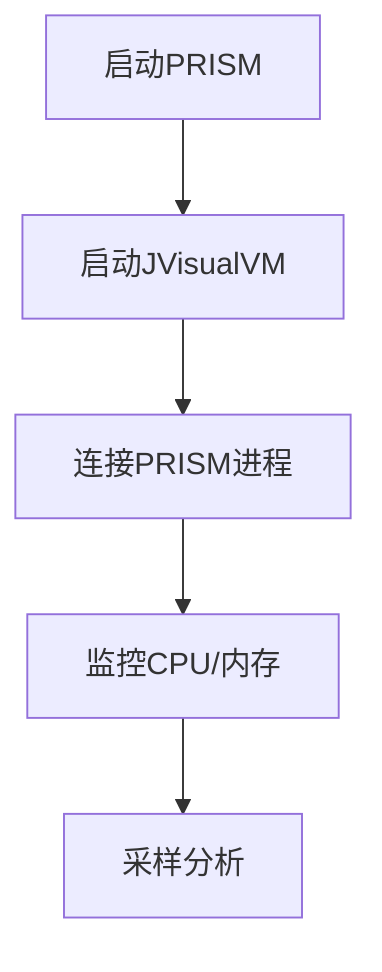

# PRISM 性能剖析

## 介绍

PRISM是一个用于概率模型检查的工具，但在处理复杂模型时可能会遇到性能问题。性能剖析（Profiling）是识别和解决这些问题的关键步骤。本章将介绍如何使用PRISM内置工具和外部方法分析性能瓶颈，并提供优化建议。

## 性能剖析基础

性能剖析主要关注以下方面：
1. **内存使用**：模型状态空间大小
2. **计算时间**：各阶段耗时（如模型构建、概率计算）
3. **算法效率**：迭代次数/收敛速度

:::tip
使用PRISM的 `-verbose` 标志可获取基本性能信息：
```bash
prism model.pm props.pctl -verbose
```
:::

## PRISM 内置剖析工具

### 1. 统计输出

在命令行添加 `-stats` 参数：
```bash
prism model.pm props.pctl -stats
```

示例输出：
```
Model construction time: 12.4s
Model checking time: 3.7s
Total states: 1,245,678
Max states per iteration: 256,891
```
关键指标说明：
- **State explosion**：状态数指数增长问题
- **MTBDD nodes**：决策图节点数影响内存

### 2. 详细日志模式

使用 `-exportresults` 导出详细数据：
```bash
prism model.pm props.pctl -exportresults res.txt
```

## 外部剖析方法

### 1. 使用JVisualVM（Java工具）



### 2. 内存分析示例

:::note
典型内存问题模式：
```java
// 伪代码展示状态存储
StateStorage {
    HashMap<State, Double> probabilities; // 可能消耗大量内存
}
```
:::

## 性能优化案例

### 案例1：减少状态空间

原始模型：
```
module M
    x : [0..1000] init 0;
    [step] x < 1000 -> (x' = x + 1);
endmodule
```

优化后（使用抽象）：
```
module M
    x : [0..10] init 0; // 按比例缩小
    [step] x < 10 -> (x' = x + 1);
endmodule
```

### 案例2：算法选择

比较不同引擎：
```bash
prism model.pm -explicit # 显式引擎
prism model.pm -mtbdd   # 符号引擎
```

## 常见瓶颈与解决方案

| 问题类型 | 检测方法 | 解决方案 |
|---------|----------|----------|
| 内存不足 | JVisualVM监控 | 使用`-javamaxmem`参数 |
| 计算缓慢 | 时间统计 | 切换引擎(`-hybrid`) |
| 状态爆炸 | `-stats`输出 | 模型抽象简化 |

## 总结与练习

### 关键要点
- 始终从`-stats`开始基础分析
- 大型模型优先考虑内存使用
- 不同问题可能需要不同引擎

### 练习建议
1. 对一个简单模型分别使用`-explicit`和`-mtbdd`引擎，比较性能统计
2. 使用JVisualVM监控PRISM处理不同规模模型时的内存变化

### 扩展资源
- PRISM官方文档中的[性能调优章节](https://www.prismmodelchecker.org/manual/)
- Java性能分析工具[JProfiler](https://www.ej-technologies.com/products/jprofiler/overview.html)