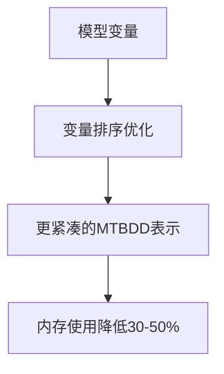

# PRISM 内存优化

## 介绍

PRISM作为概率符号模型检查器，在处理复杂模型时可能面临内存消耗过高的问题。本指南将介绍常见的内存优化技术，帮助初学者减少PRISM运行时的内存占用，提升模型验证效率。

## 为什么需要内存优化？

当PRISM分析大型马尔可夫链或概率自动机时，内存可能成为瓶颈：
- 状态空间爆炸问题（State Space Explosion）
- 中间数据结构占用过多内存
- 并行计算时的内存复制开销

:::tip 关键概念
PRISM的内存使用主要取决于：
1. 模型的状态空间大小
2. 属性验证算法的选择
3. 符号表示（MTBDD）的压缩效率
:::

## 基础优化技术

### 1. 模型简化

```prism
// 优化前：冗余的同步动作
module Process1
    [act] x=0 -> 1:(x'=1);
endmodule

module Process2
    [act] y=0 -> 1:(y'=1);
endmodule

// 优化后：合并相同动作
module Combined
    [act] x=0 & y=0 -> 1:(x'=1) & (y'=1);
endmodule
```

### 2. 状态变量压缩

```prism
// 原始定义（占用更多内存）
x : [0..1000]; // 需要11位存储

// 优化后（减少取值范围）
x : [0..127];  // 仅需7位存储
```

## 高级优化策略

### 1. 符号表示优化

PRISM默认使用MTBDD（多终端二叉决策图）存储模型：



通过实验确定最优变量排序：
```bash
prism model.pm -varorder 3,1,2
```

### 2. 近似方法

对于超大模型，可考虑：
- 状态聚合（State Aggregation）
- 概率界限近似
- 蒙特卡洛模拟

## 实战案例：通信协议分析

分析一个无线传感器网络协议时，原始模型导致内存溢出（>16GB）：

1. **问题诊断**：
   ```bash
   prism protocol.pm -verbose
   ```
   输出显示MTBDD节点超过200万

2. **优化步骤**：
   - 将`[0..1000]`的计时器范围缩小为`[0..15]`
   - 使用`-ordermethod random`尝试10种变量排序
   - 启用`-hybrid`引擎组合符号/显式方法

3. **优化结果**：
   ```
   Memory usage reduced from 16GB to 2.3GB
   Verification time decreased by 65%
   ```

## 配置参数调优

关键命令行选项：

| 参数 | 作用 | 推荐值 |
|------|------|--------|
| `-javamaxmem` | 设置JVM堆内存 | 模型大小的2-3倍 |
| `-cuddmaxmem` | CUDD内存限制 | 物理内存的50-70% |
| `-hybrid` | 启用混合引擎 | 大型稀疏模型 |
| `-sym` | 纯符号方法 | 小型规则模型 |

:::warning 注意
过度优化可能导致精度损失，建议通过`-sim`参数验证结果的正确性
:::

## 总结与练习

**主要收获**：
- 模型设计阶段就要考虑内存效率
- 变量排序显著影响符号表示效率
- 混合方法可以平衡内存和速度

**练习任务**：
1. 下载PRISM自带的`firewire.prism`示例
2. 尝试不同的变量排序（`-varorder`）
3. 比较内存使用和运行时间变化

**扩展阅读**：
- PRISM手册中的"Memory Management"章节
- 《Principles of Model Checking》第10章
- CUDD包文档（PRISM使用的决策图库）