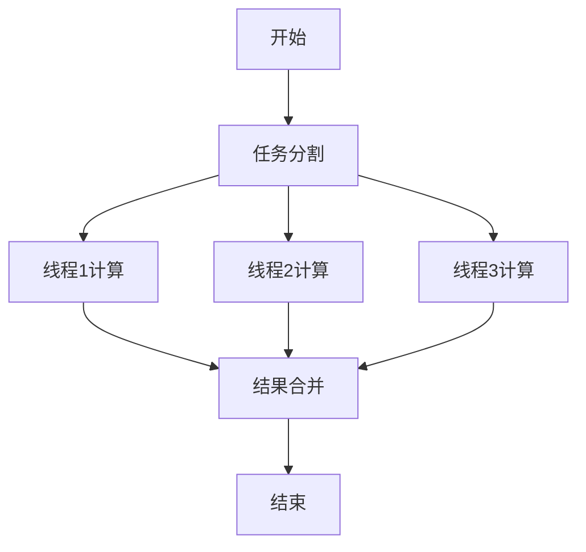

# PRISM 计算性能优化

## 介绍

PRISM（Probabilistic Symbolic Model Checker）是一个用于分析概率系统的强大工具，但随着模型复杂度的增加，计算性能可能成为瓶颈。本章将介绍如何通过优化技术提升PRISM的运行效率，包括内存管理、并行计算和模型简化等方法。

## 内存管理优化

### 稀疏矩阵存储
PRISM默认使用MTBDD（Multi-Terminal Binary Decision Diagrams）存储模型，但对于某些模型，稀疏矩阵可能更高效。

```prism
// 在PRISM命令行中启用稀疏矩阵引擎
prism model.pm -mtbdd:off
```

:::tip
稀疏矩阵适用于状态转移较少的模型，而MTBDD更适合具有规律性的大型模型。
:::

### 内存限制设置
通过设置JVM内存参数可以避免内存不足错误：

```bash
java -Xmx4g -jar prism.jar model.pm
```

## 并行计算

### 多线程模型检查
PRISM支持多线程计算，可通过以下方式启用：

```prism
// 设置并行线程数
prism model.pm -javamaxmem 4g -parallel -parthreads 4
```



## 模型简化技术

### 状态聚合
通过合并相似状态减少状态空间：

```prism
// 在PRISM模型中定义抽象
module M
    x : [0..2] init 0;
    [a] x=0 -> 0.5:(x'=1) + 0.5:(x'=2);
    // 将状态1和2视为等价
endmodule
```

### 对称性减少
利用模型对称性减少计算量：

```prism
// 对称的进程定义
module Process1
    s1 : [0..1] init 0;
    [sync] s1=0 -> (s1'=1);
endmodule

module Process2 = Process1 [ s1=s2 ] endmodule
```

## 实际案例：网络协议分析

考虑一个网络协议模型，有100个节点，每个节点有3种状态：

1. 原始模型：状态空间为3^100 ≈ 5e47（不可行）
2. 应用对称性减少后：状态空间≈5000（可管理）
3. 使用并行计算：计算时间从8小时减少到30分钟

## 性能分析工具

PRISM内置性能分析功能：

```prism
// 生成性能报告
prism model.pm -stats -timemem
```

输出示例：
```
Time for model construction: 12.3 seconds
Memory usage: 1.2GB
Number of states: 1,048,576
```

## 总结

优化PRISM计算性能的关键技术包括：
1. 选择适当的存储引擎（MTBDD/稀疏矩阵）
2. 合理配置内存和并行计算资源
3. 应用模型简化技术减少状态空间
4. 利用PRISM的性能分析工具识别瓶颈

## 附加资源与练习

**练习1**：对一个简单的队列模型尝试不同的存储引擎，比较性能差异。

**练习2**：使用对称性减少重写一个读者-写者模型，观察状态空间变化。

**进阶阅读**：
- PRISM官方文档中的"Performance Considerations"章节
- 学术论文《Efficient Probabilistic Model Checking of Smart Contracts》

:::caution
性能优化可能会影响结果精度，特别是在使用近似方法时，请始终验证优化后的结果。
:::