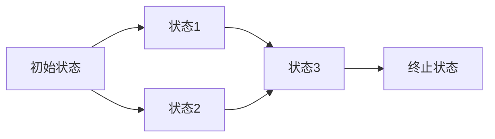

# PRISM 状态空间管理

## 介绍

状态空间管理是PRISM模型检查器中的核心概念。当您使用PRISM分析概率模型时，系统会生成所有可能的状态及其转移关系，形成状态空间。随着模型复杂度增加，状态空间可能呈指数级增长（称为"状态爆炸问题"）。有效的状态空间管理技术能显著提升分析效率。

:::note 什么是状态空间？
状态空间是模型所有可能配置的集合，每个状态代表系统在某一时刻的完整描述，包括所有变量的值。
:::

## 状态空间基础

PRISM中的状态空间通常表示为有向图：



## 状态空间压缩技术

### 1. 稀疏矩阵存储

PRISM默认使用稀疏矩阵格式存储转移矩阵，只保存非零元素：

```
// 传统矩阵表示
0.5 0.5 0
0   0.7 0.3
0   0   1

// 稀疏表示
(0,0)=0.5, (0,1)=0.5
(1,1)=0.7, (1,2)=0.3
(2,2)=1
```

### 2. 对称性归约

利用模型对称性减少状态数量，在模型文件中添加：

```prism
// 在PRISM模型中使用对称性
symm "process1", "process2", "process3";
```

### 3. 状态聚合

合并行为相同的状态：

```prism
// 聚合示例
module Process
    s : [0..2] init 0;
    [act] s=0 -> 0.5:(s'=1) + 0.5:(s'=2);
    // 状态1和2的行为相同
    [step] s=1 -> (s'=0);
    [step] s=2 -> (s'=0);
endmodule
```

## 状态空间优化策略

### 1. 模型抽象

使用抽象技术减少状态数量：

```prism
// 原始模型
const int N = 100;
x : [0..N];

// 抽象后
const int N = 10; // 减少精度
x : [0..N];
```

### 2. 变量排序优化

PRISM变量顺序影响内存使用，可通过以下命令测试：

```bash
prism model.pm -varorder "x,y,z"
```

### 3. 内存管理参数

调整JVM内存设置：

```bash
prism model.pm -javamaxmem 4g
```

## 调试状态空间问题

### 1. 状态空间统计

获取状态空间信息：

```bash
prism model.pm -stats
```

输出示例：
```
States:     1,048,576
Transitions: 3,145,728
Build time: 12.3 seconds
```

### 2. 状态空间可视化（小型模型）

```bash
prism model.pm -exportstates states.txt
```

### 3. 常见错误处理

:::warning 内存不足错误
如果遇到"Out of memory"错误：
1. 尝试使用状态空间压缩技术
2. 增加JVM内存：`-javamaxmem 8g`
3. 考虑模型抽象或分解
:::

## 实际案例研究

**案例：网络协议分析**

分析一个简单的重传协议，比较不同参数下的状态空间：

```prism
// 协议模型
module Sender
    s : [0..2]; // 0=ready, 1=waiting, 2=retry
    [send] s=0 -> 0.9:(s'=0) + 0.1:(s'=1);
    [timeout] s=1 -> (s'=2);
    [retry] s=2 -> (s'=0);
endmodule
```

状态空间随重试次数变化：
- 最大重试次数=3：15个状态
- 最大重试次数=5：63个状态
- 最大重试次数=10：2,047个状态

## 总结

PRISM状态空间管理的关键要点：
1. 理解状态空间如何随模型复杂度增长
2. 掌握稀疏存储和对称性归约等压缩技术
3. 学会使用PRISM工具分析状态空间统计信息
4. 合理配置内存参数和变量顺序

## 扩展练习

1. 创建一个简单队列模型，测试不同队列容量下的状态空间增长
2. 尝试使用`-exporttrans`导出转移关系并可视化
3. 比较不同变量排序对构建时间的影响

## 附加资源

- PRISM手册：状态空间优化章节
- 《Principles of Model Checking》第10章
- 学术论文："Efficient State Space Exploration for PRISM Models"