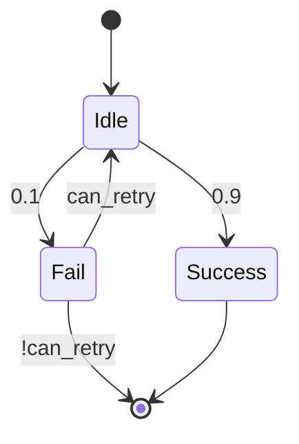

# PRISM 模型重构技术

## 引言

PRISM模型重构是指在不改变模型行为的前提下，通过结构调整、模块化或语法优化来提升模型质量的技术。重构后的模型应保持与原模型相同的概率语义，但具有更好的可读性、更高效的验证性能或更强的复用性。本教程将介绍PRISM重构的核心方法，并通过实例演示如何逐步优化模型。

## 为什么需要模型重构？

原始PRISM模型可能因为以下原因需要重构：
- 状态空间爆炸导致验证效率低下
- 重复代码块难以维护
- 复杂逻辑影响可读性
- 需要复用特定模块

:::tip 重构原则
1. 保持语义等价性
2. 每次只做一个逻辑变更
3. 重构后必须重新验证
:::

## 基础重构技术

### 1. 模块化分解

将大型单体模型拆分为交互模块：

```prism
// 重构前 - 单模块系统
module system
    s : [0..2] init 0;
    [act] s=0 -> 0.5:(s'=1) + 0.5:(s'=2);
endmodule

// 重构后 - 多模块系统
module phase1
    s : [0..1] init 0;
    [act] s=0 -> (s'=1);
endmodule

module phase2
    t : [0..1] init 0;
    [act] t=0 -> 0.5:(t'=1);
endmodule
```

### 2. 常量提取

替换硬编码值为命名常量：

```prism
// 重构前
const int MAX = 100;
module queue
    q : [0..100];
    // ...
endmodule

// 重构后
const int MAX_QUEUE_SIZE = 100;
module queue
    q : [0..MAX_QUEUE_SIZE];
    // ...
endmodule
```

## 高级重构模式

### 1. 状态空间压缩

使用枚举类型减少状态变量：

```prism
// 重构前 - 多个布尔变量
module protocol
    req1 : bool; req2 : bool;
    ack : bool;
    // 组合状态: 2^3=8种
endmodule

// 重构后 - 枚举状态
module protocol
    state : [0..3]; // 0:idle, 1:req1, 2:req2, 3:ack
    // 仅4种状态
endmodule
```

### 2. 概率抽象

将复杂概率分布封装为宏：

```prism
// 重构前
[] state=0 -> 0.3:(state'=1) + 0.7:(state'=2);

// 重构后
macro prob_dist = 0.3:(state'=1) + 0.7:(state'=2);
[] state=0 -> prob_dist;
```

## 实际案例研究

### 网络协议重试机制优化

原始模型存在冗余的重试逻辑：

```prism
module sender
    attempts : [0..3];
    [send] status=idle & attempts<3 -> 
        0.9:(status'=success) + 0.1:(status'=fail & attempts'=attempts+1);
    [timeout] status=fail -> 
        (status'=idle);
endmodule
```

重构后版本：

```prism
const int MAX_ATTEMPTS = 3;
formula can_retry = attempts < MAX_ATTEMPTS;

module sender
    attempts : [0..MAX_ATTEMPTS];
    [send] status=idle & can_retry -> 
        0.9:(status'=success) + 
        0.1:(status'=fail & attempts'=attempts+1);
    [retry] status=fail & can_retry -> 
        (status'=idle);
endmodule
```

优化效果：
- 状态空间从 4×2=8 减少到 4+2=6 种
- 重试逻辑集中管理
- 最大尝试次数可配置



## 验证重构正确性

使用PRISM的等价性检查命令：
```bash
prism orig_model.pm refined_model.pm \
    -pf "P=? [ F success ]" \
    -simpath 1000
```

比较两个模型在相同属性下的验证结果，差异应小于统计误差范围。

## 总结与练习

### 关键要点
- 重构是改善模型质量的系统性方法
- 模块化是控制状态空间爆炸的有效手段
- 常量提取增强模型的可维护性
- 始终通过形式化验证确认重构正确性

### 推荐练习
1. 将以下模型模块化：
```prism
module system
    x : [0..5]; y : [0..5];
    [] x<5 & y<5 -> 0.5:(x'=x+1) + 0.5:(y'=y+1);
endmodule
```

2. 为交通灯系统设计状态枚举：
```prism
module light
    red : bool; amber : bool; green : bool;
    // 互斥状态转换逻辑
endmodule
```

3. 创建一个宏来封装指数退避的重试策略

### 延伸阅读
- PRISM官方手册《Model Refactoring Guidelines》
- 《Probabilistic Model Checking》第6章
- 论文《State Space Reduction Techniques in PRISM》

通过系统性的重构实践，你将能够构建更高效、更可靠的PRISM模型！