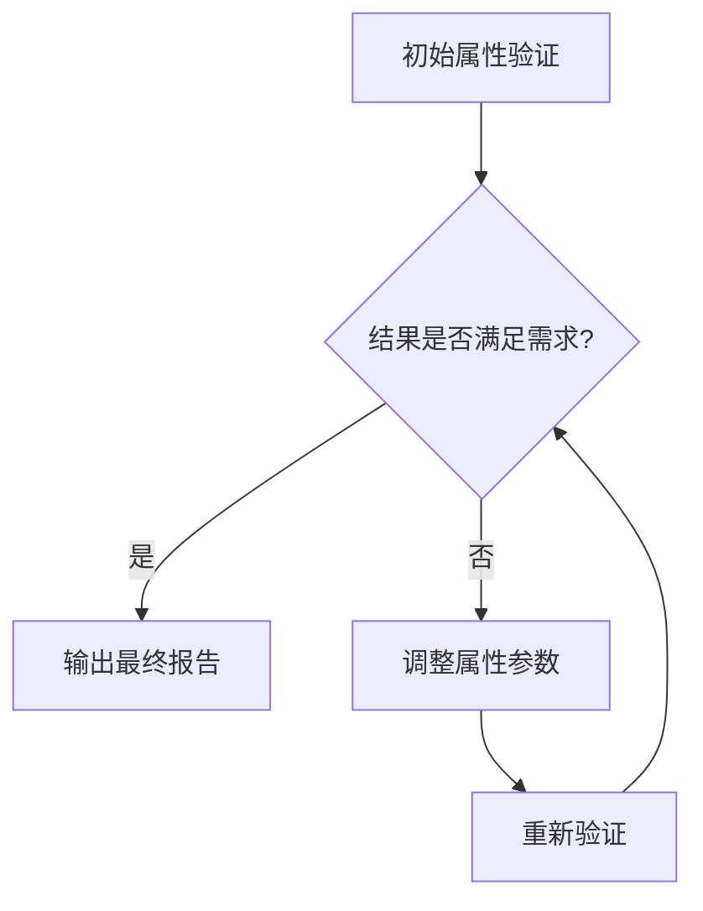

# PRISM 动态属性调整

## 简介

PRISM（Probabilistic Symbolic Model Checker）是一个用于建模和分析概率系统的工具。动态属性调整是指在模型验证过程中，根据中间结果或需求变化，灵活修改待验证的属性（Property）。这一技术能显著提升验证效率，尤其适用于复杂系统或需要多次迭代的场景。

## 为什么需要动态属性调整？

1. **性能优化**：避免重复验证相似属性。
2. **适应性验证**：根据初步结果调整验证方向。
3. **资源节约**：减少不必要的计算开销。

---

## 基础操作步骤

### 1. 定义初始属性
在PRISM中，属性通常以PCTL/CSL等逻辑公式表示。例如：
```prism
P=? [ F "success" ]  // 计算最终达到"success"状态的概率
```

### 2. 动态修改属性
通过PRISM的API或命令行交互，可在运行时替换属性。示例流程：
1. 运行初始验证：
   ```bash
   prism model.pm props.pctl -prop 1
   ```
2. 根据输出调整属性文件 `props.pctl`，例如将概率阈值改为0.8：
   ```prism
   P>=0.8 [ F "success" ]
   ```

:::tip 交互式调试
使用PRISM的`-interactive`模式逐步调整：
```bash
prism model.pm -interactive
```
:::

---

## 实际案例：网络协议重传机制

### 场景描述
验证一个数据包重传协议，要求：
- 初始属性：`P=? [ F<=10 "delivered" ]`（10步内送达概率）
- 发现概率过低后，调整为检查平均重传次数：
  ```prism
  R{"retries"}=? [ C<=10 ]
  ```

### 代码对比
**调整前属性文件**：
```prism
// props.pctl
P=? [ F<=10 "delivered" ]
```

**调整后属性文件**：
```prism
// props_updated.pctl
R{"retries"}=? [ C<=10 ]
```

---

## 高级技巧

### 条件属性调整
通过PRISM的`filter`功能实现结果驱动的动态调整：
```prism
filter(print, P>=0.9 [ F "success" ], "ProbSuccess")
```

### 自动化脚本示例
使用Bash脚本动态生成属性：
```bash
#!/bin/bash
INIT_PROB=$(prism model.pm -prop 1 | grep "Result:")
if (( $(echo "$INIT_PROB < 0.5" | bc -l) )); then
  echo 'P>=0.5 [ F "success" ]' > new_props.pctl
fi
```

---

## 可视化分析



---

## 总结与练习

### 关键点总结
1. 动态属性调整是PRISM的重要调试手段
2. 可通过交互模式或脚本实现自动化
3. 结合过滤器和条件判断提升效率

### 练习建议
1. 在PRISM GUI中手动修改属性并观察结果变化
2. 编写脚本实现：当概率低于阈值时自动放宽时间约束
3. 尝试用`filter`命令实现多属性批处理验证

### 扩展阅读
- PRISM官方文档《Property Specification》
- 《Principles of Model Checking》第10章
``` 

注：所有代码块均使用 