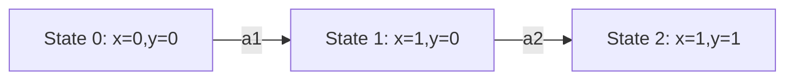

# PRISM 反例分析

## 介绍

在模型检查中，当PRISM验证某个属性不成立时（例如“系统永远不会死锁”），它会生成一个**反例（counterexample）**——即一条导致属性违反的路径。反例分析是调试和优化模型的关键步骤，它能帮助开发者定位设计缺陷或逻辑错误。本章将介绍如何解读PRISM反例，并通过实际案例演示分析流程。

---

## 反例的基本结构

PRISM反例通常包含以下信息：
1. **状态序列**：从初始状态到违反属性的状态路径。
2. **概率/奖励值**：路径的累积概率或奖励（若涉及定量属性）。
3. **触发动作**：导致状态转移的动作或事件。

:::note
反例可以是**确定性路径**（如DTMC/CTMC）或**树状结构**（如MDP），具体取决于模型类型。
:::

---

## 生成反例

在PRISM命令行或GUI中，使用 `-exportcounterexample` 参数导出反例。例如：
```bash
prism model.pm props.pctl -exportcounterexample example.txt
```

输出文件会包含状态序列和转移细节：
```text
Counterexample for property "P>=0.9 [ F \"success\" ]":
State 0: x=0, y=0
Action: "a1" -> State 1: x=1, y=0 (probability=0.5)
State 1: x=1, y=0
Action: "a2" -> State 2: x=1, y=1 (probability=0.5) [property violated]
```

---

## 反例分析步骤

### 1. 验证反例的有效性
检查反例是否确实违反属性。例如，手动模拟状态序列：


### 2. 定位关键状态
找到第一个导致属性失败的状态（如上例中的 `State 2`）。

### 3. 分析触发条件
检查导致关键状态的动作（`a2`）和前置条件（`x=1` 且 `y=0`）。

---

## 实际案例：通信协议超时

假设我们验证一个通信协议的“消息最终必达”属性时失败。PRISM生成的反例如下：
```text
State 0: sent=0, ack=0
Action: "send" -> State 1: sent=1, ack=0
State 1: sent=1, ack=0
Action: "timeout" -> State 0: sent=0, ack=0 [循环]
```

**问题分析**：
1. 反例显示系统在 `sent=1` 时因超时重置，陷入无限循环。
2. 根本原因：未处理网络丢包，缺少重发机制。

**修复方案**：在模型中添加重试次数限制：
```prism
// 修改后的DTMC片段
module Sender
    retries : [0..3] init 0;
    [send] (retries < 3) -> 0.9: (sent'=1) & (retries'=retries+1) + 0.1: (retries'=retries+1);
    [timeout] (retries >= 3) -> (sent'=0) & (retries'=0);
endmodule
```

---

## 总结

反例分析是PRISM调试的核心环节，通过以下步骤实现：
1. 生成并导出反例。
2. 手动验证路径有效性。
3. 定位关键状态和动作。
4. 修正模型逻辑或参数。

---

## 练习与资源

### 练习
1. 在PRISM GUI中加载 `leader_election.prism`，验证“最终选出领导者”属性，并分析反例。
2. 修改模型使属性成立，重新验证。

### 附加资源
- PRISM手册：[Counterexample Generation章节](http://www.prismmodelchecker.org/manual/)
- 《Principles of Model Checking》第10章（反例与证据）