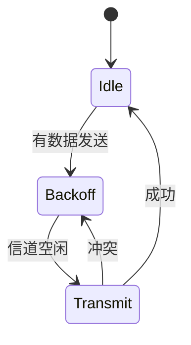

# PRISM 通信协议验证

## 引言

通信协议是分布式系统和网络中的核心组件，其正确性直接影响系统可靠性。PRISM作为**概率符号模型检测器**，能够通过形式化方法验证协议是否满足预期性质（如无死锁、消息可达性等），尤其适用于带有随机行为的协议（如无线通信中的丢包场景）。

## 基础概念

### 1. 为什么需要形式化验证？
- **传统测试的局限性**：无法覆盖所有可能的执行路径。
- **PRISM的优势**：通过建模协议的状态空间和概率行为，穷举所有可能性并验证性质。

### 2. 关键验证目标
- **安全性**：如"永远不会发生未授权访问"。
- **活性**：如"消息最终会被接收"。
- **概率性质**：如"消息在3次重传内到达的概率≥99%"。

## 建模通信协议

### 示例：简单重传协议
考虑一个发送方和接收方之间的协议，消息可能丢失，发送方会重试最多3次。

```prism
// PRISM模型：带重传的通信协议
dtmc

module Sender
    s_state: [0..3] init 0;  // 0=空闲, 1=发送, 2=等待ACK, 3=失败
    [send] s_state=0 -> 0.9:(s_state'=1) + 0.1:(s_state'=0);  // 发送或保持
    [retry] s_state=2 -> 0.8:(s_state'=1) + 0.2:(s_state'=3); // 重试或放弃
endmodule

module Receiver
    r_state: [0..1] init 0;  // 0=等待, 1=已接收
    [recv] r_state=0 & s_state=1 -> 0.7:(r_state'=1) + 0.3:(r_state'=0);
endmodule
```

### 性质验证
验证"消息最终成功接收的概率"：
```prism
P>=1 [ F r_state=1 ]
```

## 实际案例研究

### IEEE 802.11 MAC协议
PRISM曾用于验证WiFi协议的退避机制：
1. **模型**：将竞争窗口和随机退避时间建模为概率转换。
2. **验证性质**：
   - "两个节点不会永远冲突"
   - "信道利用率不低于阈值"



## 进阶技巧

### 参数化验证
通过PRISM的`const`定义可调整参数，快速测试不同场景：
```prism
const double p_loss = 0.1; // 丢包率
// 在模型中引用p_loss
[send] s_state=0 -> (1-p_loss):(s_state'=1) + p_loss:(s_state'=0);
```

## 总结

- PRISM能有效验证通信协议的**确定性**和**概率性**质。
- 典型应用包括：重传机制、多路访问协议、路由协议等。
- 通过组合**离散时间马尔可夫链(DTMC)**和**概率计算树逻辑(PCTL)**表达复杂需求。

## 延伸资源

1. **练习**：修改重传次数上限，观察成功概率变化。
2. **官方案例库**：PRISM官网的`protocols`目录。
3. **论文参考**：*"Formal Verification of the IEEE 802.11 WLAN Protocol"*

:::tip 实践建议
从简单协议（如停等协议）开始建模，逐步添加复杂特性（如超时、拥塞控制）。
:::