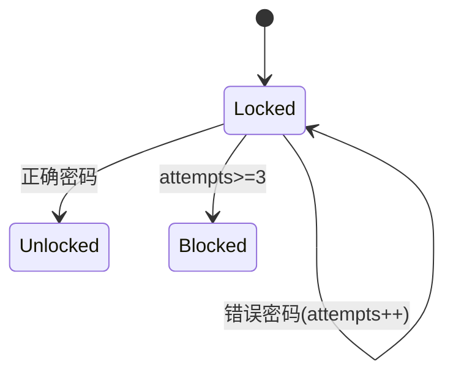

# PRISM 安全与隐私分析

## 引言
PRISM（Probabilistic Symbolic Model Checker）是一个用于建模和分析概率系统的工具，广泛应用于**安全与隐私分析**领域。通过形式化建模和概率验证，PRISM可以帮助开发者评估系统在面临攻击或隐私泄露时的行为，例如计算攻击成功的概率或敏感信息暴露的风险。

## 核心概念
### 1. 安全分析
PRISM可对以下安全属性进行验证：
- **攻击成功率**：计算攻击者达成目标的概率
- **系统脆弱性**：识别最可能被利用的路径
- **防御机制效果**：量化安全策略的有效性

### 2. 隐私分析
隐私相关验证包括：
- **匿名性**：评估匿名协议的保护强度
- **数据泄露概率**：计算敏感信息被推断的可能性
- **差分隐私**：验证隐私保护机制的数学保证

## 建模示例：简单认证系统
以下是一个三次尝试密码认证的PRISM模型：

```prism
// 模型定义
dtmc

module Authentication
    attempts : [0..3] init 0;
    authenticated : bool init false;

    // 正确密码概率0.1
    [] attempts < 3 & !authenticated -> 
        0.1 : (authenticated'=true) + 
        0.9 : (attempts'=attempts+1);
endmodule

// 属性验证
P=? [ F attempts=3 ]  // 最终失败的概率
P=? [ F authenticated ]  // 最终成功的概率
```

输出结果示例：
```
Property: P=? [ F attempts=3 ]
Result: 0.729 (72.9%的失败概率)

Property: P=? [ F authenticated ]
Result: 0.271 (27.1%的成功概率)
```

## 实际应用案例
### 案例1：物联网设备安全
分析智能门锁的暴力破解防护：
1. 建模尝试次数限制机制
2. 计算不同时间窗口内的攻击成功率
3. 验证自动锁定策略的效果



### 案例2：医疗数据隐私
评估去标识化数据集的重识别风险：
1. 建模背景知识攻击者的推理过程
2. 计算特定组合属性导致重新识别的概率
3. 验证k-匿名性是否满足要求

## 进阶技巧
:::tip 状态聚合
对于大型系统，使用以下技术优化分析：
- 合并对称状态
- 抽象简化非关键组件
- 模块化独立子系统
:::

## 总结
PRISM为安全与隐私分析提供了：
- 严格的概率验证方法
- 量化的风险评估指标
- 可重复的实验框架

## 扩展资源
1. 推荐练习：建模一个带指数退避的登录系统
2. 进阶阅读：PRISM官方案例库中的"Security Protocols"部分
3. 研究论文：《Probabilistic Model Checking for Anonymity Verification》