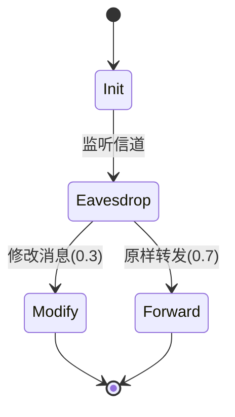

# PRISM 网络安全验证

## 引言
PRISM（Probabilistic Symbolic Model Checker）是一种用于分析概率系统的形式化验证工具。在网络安全领域，PRISM可用于验证加密协议、入侵检测系统等场景中的**概率性安全属性**（如"攻击者成功破解密钥的概率不超过0.1%"）。本文将介绍如何用PRISM建模网络安全问题。

## 基础概念

### 为什么需要概率验证？
网络安全协议常涉及：
- 随机数生成
- 概率性攻击（如暴力破解）
- 不可靠通信信道

PRISM能计算：
```prism
P=? [ F (attack_success) ]  // 攻击最终成功的概率
```

### 典型验证属性
| 属性类型 | PRISM语法示例 | 说明 |
|----------|---------------|------|
| 概率可达性 | `P>=0.99 [ F auth_success ]` | 认证成功率≥99% |
| 期望值 | `R{"energy"}<=10 [ F complete ]` | 能耗期望≤10单位 |
| 稳态概率 | `S<=0.01 [ compromised ]` | 长期被入侵概率≤1% |

## 案例研究：密钥交换协议

### 1. 建模Dolev-Yao攻击者


对应的PRISM模型片段：
```prism
module Attacker
    action: [0..2] init 0; // 0=监听, 1=修改, 2=转发
    
    [msg_sent] action=0 -> 0.3: (action'=1) + 0.7: (action'=2);
    [msg_sent] action!=0 -> true;
endmodule
```

### 2. 验证保密性
计算攻击者获取密钥的概率：
```prism
const double p_intercept = 0.4; // 拦截概率
P=? [ F (attacker_knows_key) ] 
```

## 实践示例：WiFi重放攻击

### 模型参数定义
```prism
// 系统参数
const int MAX_RETRY = 3;
const double p_replay_success = 0.25; // 单次重放成功率

// 攻击者模块
module Attacker
    retry: [0..MAX_RETRY] init 0;
    [replay] retry<MAX_RETRY -> p_replay_success: (retry'=retry+1)
                              + (1-p_replay_success): (retry'=retry+1);
endmodule
```

### 安全属性验证
```prism
// 重放攻击在3次尝试内成功的概率
P<=0.05 [ F<=100 (attack_success) ]

// 期望尝试次数
R{"retries"}<=2 [ F attack_success|fail ]
```

## 实际应用场景

:::note 案例：TLS握手验证
某企业用PRISM验证其TLS实现：
1. 建模握手流程（ClientHello→ServerHello→...）
2. 添加概率性丢包模型
3. 验证 `P>=0.999 [ F handshake_complete ]`
发现当丢包率>15%时，握手成功率骤降，于是优化了重传机制。
:::

## 总结与练习

### 关键点总结
- PRISM可量化评估网络安全风险
- 需准确定义概率参数（如攻击成功率）
- 组合使用`P`、`R`、`S`运算符验证不同属性

### 练习建议
1. 建模简单的挑战-响应协议，计算中间人攻击成功率
2. 尝试添加信道噪声参数（如`const double p_loss=0.1`）
3. 验证`S`属性在DoS攻击场景中的应用

### 扩展资源
- PRISM官方案例库中的`crypto.prism`
- 《Security and Probability》by Clarkson et al.
- 标准协议模型：IEEE 802.11i、IPSec等