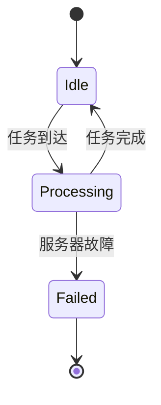

## 引言

PRISM（Probabilistic Symbolic Model Checker）是一个用于建模和分析概率系统的工具，特别适用于计算机系统性能评估。通过概率模型检测技术，PRISM能帮助开发者量化系统在不确定性环境下的表现（如吞吐量、响应时间、资源利用率等）。本章将介绍如何用PRISM建模计算机系统性能问题，并通过案例演示分析过程。

---

## 核心概念

### 1. 性能指标建模
计算机系统性能通常通过以下指标衡量：
- **吞吐量**：单位时间内完成的任务数
- **延迟**：任务从发起到完成的耗时
- **可靠性**：系统在特定时间内无故障运行的概率

在PRISM中，这些指标可以表示为：
- **离散时间马尔可夫链（DTMC）**：确定性时间步长的概率系统
- **连续时间马尔可夫链（CTMC）**：实时系统的指数分布延迟

### 2. 基本建模步骤
```prism
// 示例：简单服务器队列模型（CTMC）
ctmc

const int queue_capacity = 5;
module Server
    queue : [0..queue_capacity] init 0;
    
    [arrival] (queue < queue_capacity) -> 0.5 : (queue' = queue + 1);
    [service] (queue > 0) -> 1.0 : (queue' = queue - 1);
endmodule
```
**输出指标公式**：
```prism
// 平均队列长度
rewards "avg_queue_length"
    queue > 0 : queue;
endrewards
```

---

## 实际案例：云计算任务调度

### 问题描述
分析云计算环境中任务调度的成功率，假设：
- 任务到达率：λ = 2/秒（泊松过程）
- 服务率：μ = 3/秒（指数分布）
- 服务器宕机概率：0.1%/小时

### PRISM 模型
```prism
ctmc

const double lambda = 2;  // 到达率
const double mu = 3;      // 服务率
const double fail = 0.001; // 故障率

module CloudServer
    tasks : [0..10] init 0; // 最大10个待处理任务
    operational : bool init true;
    
    // 任务到达
    [arrival] operational & (tasks < 10) -> lambda : (tasks' = tasks + 1);
    
    // 任务处理
    [service] operational & (tasks > 0) -> mu : (tasks' = tasks - 1);
    
    // 服务器故障
    [] operational -> fail : (operational' = false);
endmodule
```

### 性能查询
```prism
// 稳态时任务队列超过5个的概率
P=? [ S tasks > 5 ]

// 服务器在24小时内宕机的概率
P=? [ F<=86400 !operational ]
```

---

## 可视化分析



---

## 总结与练习

### 关键点总结
1. PRISM可通过概率模型量化性能指标
2. CTMC适合建模实时系统的随机事件
3. 奖励机制(rewards)能计算平均值类指标

### 扩展练习
1. 修改队列容量参数，观察吞吐量变化
2. 添加服务器修复概率，计算系统可用性
3. 使用`simulate`命令生成蒙特卡洛模拟数据

### 附加资源
- PRISM官方文档：性能模型案例库
- 推荐教材：《Stochastic Model Checking》by Kwiatkowska et al.
