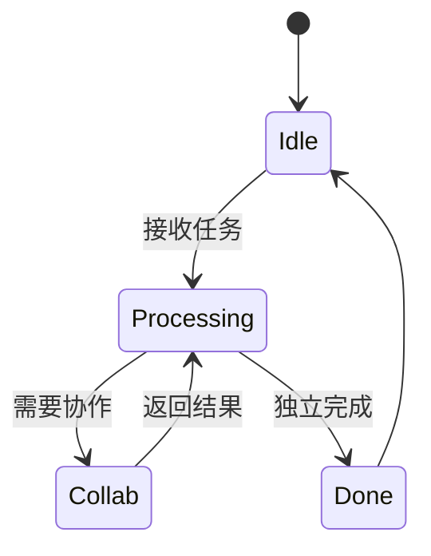

# PRISM 人工智能系统分析

## 引言

PRISM作为**概率符号模型检测器**，在人工智能系统分析中发挥着关键作用。它通过形式化建模和数学验证，帮助开发者量化AI系统的不确定性行为（如强化学习策略的可靠性或机器人决策的风险）。本指南将展示如何用PRISM建模典型AI场景，并进行概率性质验证。

## 核心概念

### 1. 马尔可夫决策过程（MDP）建模
AI系统常被建模为MDP，包含：
- **状态**：系统可能处于的情况（如机器人位置）
- **动作**：AI可执行的操作（如移动方向）
- **转移概率**：执行动作后的状态变化概率

```prism
// 无人机导航MDP示例
mdp

module Drone
    x : [0..3] init 0;  // 水平位置
    y : [0..3] init 0;  // 垂直位置

    [move_right] (x < 3) -> 0.8:(x'=x+1) + 0.1:(x'=x) + 0.1:(y'=y+1);
    [move_up]    (y < 3) -> 0.7:(y'=y+1) + 0.3:(y'=y);
endmodule
```

### 2. 概率时序逻辑
PRISM使用PCTL/CSL逻辑表达AI系统属性：
- `P>=0.9 [ F success ]`：成功概率至少90%
- `R{"energy"}<=5 [ C<=100 ]`：100步内能耗不超过5单位

## 实战案例：医疗诊断AI验证

### 模型构建
验证一个癌症诊断AI的假阳性率：

```prism
dtmc

const double p_fp = 0.07; // 假阳性基础概率
const double p_fn = 0.03; // 假阴性基础概率

module DiagnosticAI
    state : [0..2] init 0; // 0:等待, 1:阳性, 2:阴性
    
    [] state=0 -> 0.6:(state'=1) + 0.4:(state'=2);
    [] state=1 -> p_fp:(state'=2) + (1-p_fp):(state'=1);
    [] state=2 -> p_fn:(state'=1) + (1-p_fn):(state'=2);
endmodule
```

### 属性验证
```prism
// 检查长期运行中的误诊概率
P=? [ F (state=1 & "误诊") ]
P=? [ F (state=2 & "漏诊") ]
```

输出示例：
```
Result: 0.082 (误诊概率)
Result: 0.025 (漏诊概率)
```

## 进阶应用：多智能体系统



验证协作成功率：
```prism
// N个智能体的任务完成概率
filter(max, P>=0.8 [ F<=T "all_done" ], T=0..100)
```

## 总结与练习

### 关键收获
- PRISM可将AI系统转化为可验证的概率模型
- 能定量分析可靠性、风险、资源消耗等关键指标
- 支持从简单算法到复杂多智能体系统的不同粒度

### 巩固练习
1. 为扫地机器人建模：包含电量状态和随机移动模式
2. 验证"在电量耗尽前完成清洁的概率"
3. 添加故障状态并计算平均无故障时间

### 扩展资源
- PRISM官方案例库中的`ai/`目录
- 《Formal Methods for AI Systems》第6章
- 国际会议HSCC相关论文（混合系统验证）