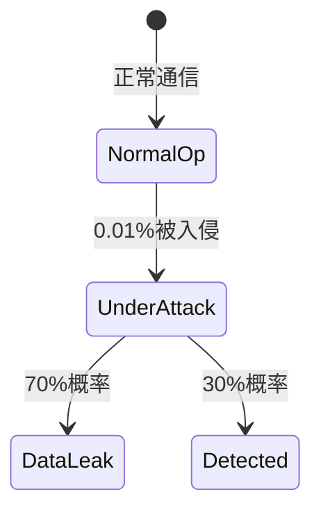

# PRISM 物联网应用验证

## 引言

物联网（IoT）系统通常由大量互联设备组成，这些设备需要在不确定的环境中可靠运行。PRISM（Probabilistic Symbolic Model Checker）作为概率模型检测工具，能够帮助开发者验证物联网系统的**概率性行为**（如通信延迟、故障率）和**时序属性**（如响应时间）。本章将介绍如何用PRISM建模典型物联网场景，并通过案例展示验证过程。

---

## 核心概念

### 1. 物联网系统的PRISM建模要素
- **概率性传输**：用离散概率分布模拟消息丢失（如 `0.8: send_ok, 0.2: lost`）
- **能耗模型**：设备电池状态转换为马尔可夫决策过程（MDP）
- **时间约束**：使用连续时间马尔可夫链（CTMC）建模传感器采样间隔

### 2. 典型验证属性
```prism
// 概率属性：消息在3次重试内到达的概率
P>=0.95 [ F<=10 retries<=3 & delivered ]

// 能耗属性：系统在100小时内不耗尽电池的概率
R{"energy"}<=100 [ C<=100 ]
```

---

## 案例：智能家居温控系统验证

### 场景描述
一个由温度传感器、控制器和空调组成的系统，要求：
1. 传感器每5分钟采样一次（可能有10%的失败率）
2. 控制器在接收数据后2秒内响应
3. 系统整体能耗不超过2W/h

### PRISM 模型片段
```prism
// 传感器模块
module Sensor
    state : [0..2] init 0;  // 0=空闲, 1=采样中, 2=发送数据
    [sample] state=0 -> 0.9:(state'=1) + 0.1:(state'=0);
    [send] state=1 -> (state'=2);
endmodule

// 能耗属性定义
rewards "energy"
    [sample] true : 0.5;  // 每次采样消耗0.5W
    [send] true : 0.3;
endrewards
```

### 验证结果
通过PRISM命令行验证：
```bash
prism smart_home.prism -pf "P>=0.98 [ F<=10s response ]"
```
输出示例：
```
Result: true (probability = 0.991)
```

---

## 进阶应用：工业物联网安全验证

### 攻击场景建模
使用**随机博弈（Stochastic Games）**模拟网络攻击：


### 安全属性验证
```prism
// 检测到攻击前数据泄露的概率
Pmax=? [ F<=1h leaked ]

// 防御策略对比（选择最优响应时间）
strategy "defense" = min(R{"time"}[F detected])
```

---

## 总结与练习

### 关键点总结
1. PRISM可通过概率模型验证IoT系统的可靠性边界
2. 能耗、时延和安全属性可统一建模
3. 随机博弈适用于安全-性能权衡分析

### 推荐练习
1. 扩展温控案例：增加多个传感器的冲突检测
2. 尝试用`multi-objective`属性优化能耗与响应时间
3. 在[PRISM案例库](http://prismmodelchecker.org/casestudies/)中查找IoT相关项目

:::tip 实验建议
使用PRISM的`simulator`模式观察单个运行轨迹，帮助理解概率行为的实际表现：
```bash
prism -sim -simpath 1000 model.pm
