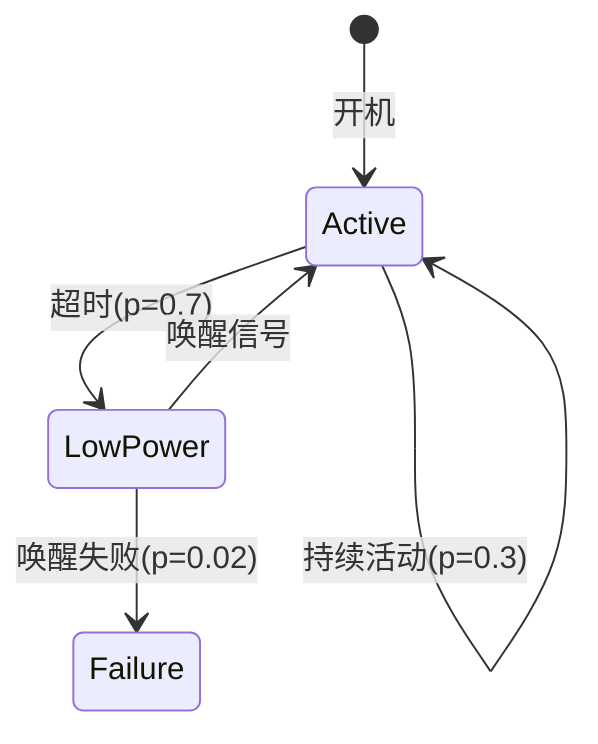

# PRISM 电子系统验证

## 引言

PRISM（Probabilistic Symbolic Model Checker）是一种用于分析**概率系统**的形式化验证工具。在电子系统设计中，PRISM可帮助工程师验证电路的可靠性、功耗模型的准确性以及故障恢复机制的有效性。本章将介绍如何通过PRISM建模电子系统，并分析其关键性能指标。

:::note 为什么需要概率验证？
电子系统常受噪声、制造偏差和随机故障影响，传统确定性分析无法覆盖这些场景。PRISM通过概率模型（如马尔可夫链）量化风险。
:::

---

## 核心概念

### 1. 电子系统的PRISM建模要素
- **状态变量**：表示电压水平、信号状态等（如 `voltage_level ∈ {0,1,2}`）
- **概率转移**：描述信号跳变或故障发生的概率
- **奖励机制**：量化功耗、延迟等指标

### 2. 典型验证场景
| 场景                | PRISM适用性           |
|---------------------|----------------------|
| 容错电路设计        | 验证故障恢复概率      |
| 低功耗模式切换      | 分析能量消耗分布      |
| 信号完整性          | 评估噪声导致的误码率  |

---

## 案例：存储器单元可靠性验证

### 问题描述
验证一个DRAM单元在存在电荷泄漏的情况下，10个时钟周期内数据保持正确的概率。

### PRISM 模型代码
```prism
// 定义状态变量（0=数据丢失，1=数据保持）
module memory_cell
    state : [0..1] init 1; // 初始状态为数据保持

    // 电荷泄漏导致状态转移（每周期5%概率丢失数据）
    [] state=1 -> 0.95 : (state'=1) + 0.05 : (state'=0);
    [] state=0 -> 1.0 : (state'=0); // 吸收状态
endmodule

// 验证属性：10周期内保持数据的概率
P=? [ F<=10 state=1 ]
```

### 输出分析
PRISM计算结果可能显示：
```
Result: 0.5987369392 (约59.87%概率)
```
表明在给定参数下，该DRAM单元需要改进电荷保持能力。

---

## 进阶案例：电源管理单元



对应的PRISM模型：
```prism
rewards "energy"
    [mode=Active] : 10; // 活跃模式功耗10mW
    [mode=LowPower] : 1; // 低功耗模式1mW
endrewards

// 验证：100周期内总能耗不超过500mW的概率
P=? [ C<=100 ]
```

---

## 实际应用技巧

:::tip 电子系统建模建议
1. **离散化连续参数**：将电压/温度等连续量分段处理（如 `voltage ∈ {low,normal,high}`）
2. **模块化设计**：分离电源、时钟和逻辑单元模型
3. **参数化分析**：使用PRISM的`const double p`定义工艺参数
:::

常见错误处理：
```prism
// 错误示例：未考虑亚稳态
[] signal_rise & clock=1 -> 0.999 : (output'=1) + 0.001 : (output'=0);

// 正确改进：增加亚稳态状态
[] signal_rise & clock=1 -> 0.99 : (output'=1) + 0.009 : (output'=0) + 0.001 : (output'=2);
```

---

## 总结与练习

### 关键点总结
- PRISM可通过概率模型捕获电子系统中的不确定性
- 奖励机制适合量化非功能属性（功耗、延迟等）
- 组合使用`P`和`R`运算符验证复杂指标

### 练习题目
1. 修改DRAM案例，假设加入ECC纠错后，每次数据丢失有80%概率被纠正，重新计算可靠性
2. 为电源管理案例添加温度影响因素，当连续5周期Active时，故障概率增加50%

### 扩展阅读
- 《Formal Methods for Analog and Mixed-Signal Circuits》
- PRISM官方案例库中的`digital_thermostat`示例