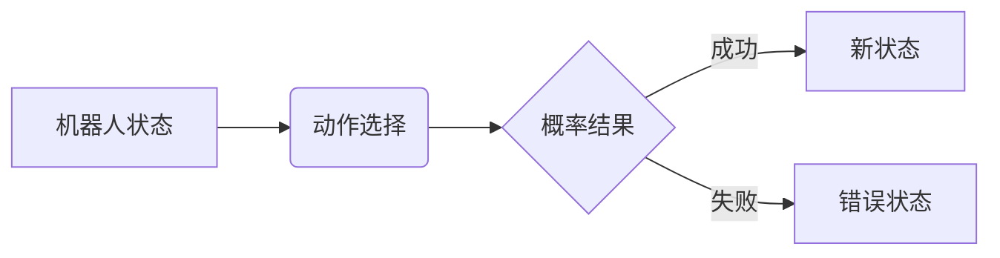

## 引言

PRISM（Probabilistic Symbolic Model Checker）是一种用于分析概率系统的形式化验证工具。在机器人系统中，PRISM可用于建模不确定性（如传感器噪声、环境动态变化）并计算关键指标（如任务成功率、碰撞概率）。本章将介绍如何用PRISM对机器人系统进行建模与分析。

## 基础概念

### 1. 机器人系统中的概率行为
机器人系统通常涉及以下概率场景：
- **动作执行不确定性**：80%概率移动成功，20%概率卡住
- **传感器误差**：距离测量存在±10%的噪声
- **环境随机性**：动态障碍物以特定概率出现

### 2. PRISM模型组件


## 建模示例

### 案例：清洁机器人导航
考虑一个在3x3网格中移动的清洁机器人，需要避免随机出现的障碍物。

#### PRISM 模型代码
```prism
// 定义网格坐标
module Robot
    x : [0..2] init 0;  // 水平位置
    y : [0..2] init 0;  // 垂直位置
    
    // 动作：向右移动（90%成功）
    [move_right] (x < 2) -> 
        0.9 : (x'=x+1) + 
        0.1 : (x'=x);
    
    // 动作：向上移动（受障碍物影响）
    [move_up] (y < 2) -> 
        0.7 : (y'=y+1) & (obstacle'=false) + 
        0.3 : (y'=y);  // 30%概率被障碍物阻挡
endmodule

// 随机出现的障碍物
module Obstacle
    obstacle : bool init false;
    [step] true -> 0.1 : (obstacle'=true) + 0.9 : (obstacle'=false);
endmodule
```

#### 属性验证示例
```prism
// 在10步内到达目标位置(2,2)的概率
P=? [ F<=10 (x=2 & y=2) ]

// 碰撞障碍物的长期概率
S=? [ obstacle=true ]
```

:::tip 模型构建技巧
1. 使用`init`关键字定义初始状态
2. 概率转移用`-> p : update`语法
3. 方括号`[]`内的标签可用于同步多个模块
:::

## 进阶应用

### 多机器人协作分析
```prism
// 两个机器人避免碰撞的场景
module Robot1
    x1 : [0..2] init 0;
    [move] (x1 < 2) & (x2 != x1+1) -> 0.8 : (x1'=x1+1);
endmodule

module Robot2
    x2 : [0..2] init 1;
    [move] (x2 < 2) & (x1 != x2+1) -> 0.8 : (x2'=x2+1);
endmodule

// 验证属性
Pmax=? [ F (x1=2 & x2=2) ]  // 最大成功概率
```

:::caution 常见错误
1. 忘记处理概率总和不为1的情况
2. 未正确定义状态空间边界
3. 忽略模块间的同步需求
:::

## 实际案例研究

### 无人机包裹递送系统
**需求分析**：
- 电池电量随机消耗
- 天气影响飞行成功率
- 多个降落点选择

**PRISM实现要点**：
```prism
// 电池模块（每步消耗1-3单位）
module Battery
    level : [0..100] init 100;
    [fly] true -> 
        0.6 : (level'=max(level-1,0)) +
        0.3 : (level'=max(level-2,0)) +
        0.1 : (level'=max(level-3,0));
endmodule

// 天气状态（Markov链）
module Weather
    state : [0..2]; // 0=晴朗, 1=多云, 2=雨天
    [] state=0 -> 0.8 : state'=0 + 0.2 : state'=1;
    [] state=1 -> 0.7 : state'=1 + 0.2 : state'=0 + 0.1 : state'=2;
    [] state=2 -> 0.5 : state'=2 + 0.5 : state'=1;
endmodule
```

## 总结

通过PRISM分析机器人系统，您可以：
1. 量化评估系统可靠性指标
2. 发现潜在设计缺陷
3. 优化概率决策逻辑
4. 验证安全关键属性

## 扩展资源

### 推荐练习
1. 修改清洁机器人模型，增加充电站功能
2. 为无人机系统添加"紧急降落"状态
3. 验证多机器人系统无死锁属性

### 进一步学习
- PRISM官方文档的[机器人案例库](https://www.prismmodelchecker.org/casestudies/)
- 《Principles of Model Checking》第10章
- 国际机器人与自动化会议（ICRA）相关论文