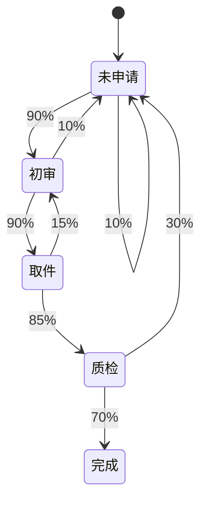

# PRISM 业务流程建模

## 引言
业务流程建模是分析复杂系统行为的重要工具，尤其在涉及不确定性或概率性决策时。PRISM（Probabilistic Symbolic Model Checker）通过形式化方法允许用户对带有概率和随机性的业务流程进行建模和验证。本章将介绍如何用PRISM建模典型业务流程，并通过案例演示其实际应用。

## 基础概念
### 1. 什么是业务流程建模？
业务流程建模是将企业或系统的工作流程抽象为可计算的模型，通常包括：
- **状态**：流程的当前情况（如"订单已提交"）
- **转移**：状态间的变化（如"支付成功→订单完成"）
- **概率/时间**：转移发生的可能性或耗时

### 2. PRISM的适用性
PRISM特别适合以下场景：
- 存在随机事件（如网络延迟、设备故障）
- 需要量化分析成功/失败概率
- 涉及并发流程的交互

## 建模方法
### 1. 基本模型结构
PRISM使用**离散时间马尔可夫链(DTMC)**或**连续时间马尔可夫链(CTMC)**建模业务流程。以下是一个订单处理系统的DTMC示例：

```prism
// 订单流程模型 (DTMC)
dtmc

module OrderProcess
    state : [0..3] init 0;  // 0=待提交, 1=已支付, 2=已发货, 3=已完成

    [] state=0 -> 0.9 : (state'=1) + 0.1 : (state'=0);  // 提交订单
    [] state=1 -> 0.8 : (state'=2) + 0.2 : (state'=0);  // 支付处理
    [] state=2 -> 0.95 : (state'=3) + 0.05 : (state'=1); // 物流配送
endmodule
```

### 2. 关键元素解释
- **状态变量**：`state`表示当前流程阶段
- **概率转移**：如`-> 0.8 : (state'=2)`表示80%概率进入下一状态
- **模块化**：`module`封装相关业务流程

## 实际案例：电商退货流程
### 1. 问题描述
分析一个电商平台的退货流程：
1. 用户发起退货请求（90%通过初审）
2. 物流取件（85%成功）
3. 质检（70%通过则退款，30%退回用户）

### 2. PRISM模型实现
```prism
dtmc

module ReturnProcess
    phase : [0..4] init 0; // 0=未申请, 1=初审, 2=取件, 3=质检, 4=完成

    // 用户发起申请
    [] phase=0 -> 0.1 : (phase'=0) + 0.9 : (phase'=1);

    // 初审结果
    [] phase=1 -> 0.9 : (phase'=2) + 0.1 : (phase'=0);

    // 物流取件
    [] phase=2 -> 0.85 : (phase'=3) + 0.15 : (phase'=1);

    // 质检处理
    [] phase=3 -> 0.7 : (phase'=4) + 0.3 : (phase'=0);
endmodule

// 计算最终退款概率
label "refund" = phase=4;
```

### 3. 分析验证
使用PRISM计算属性：
```prism
P=? [ F "refund" ]
```
输出结果示例：
```
Result: 0.535 (概率53.5%)
```

## 可视化流程


## 进阶技巧
### 1. 加入时间因素（CTMC）
```prism
ctmc

module Delivery
    status : [0..2]; // 0=打包, 1=运输, 2=签收

    [] status=0 -> 1.2 : (status'=1); // 平均打包时间5/6小时
    [] status=1 -> 0.5 : (status'=2); // 平均运输时间2小时
endmodule
```

### 2. 奖励机制分析
```prism
rewards "processing_time"
    status=0 : 5/6; // 打包时间奖励
    status=1 : 2;    // 运输时间奖励
endrewards
```

## 总结
- PRISM可将业务流程转化为概率模型
- 通过状态和转移描述工作流
- 能计算关键指标（成功率、平均耗时）
- 适用于存在不确定性的复杂流程

## 练习与资源
### 实践练习
1. 修改退货流程模型，增加15%的质检失败直接退款情况
2. 为订单流程添加超时自动取消功能（假设每步有5%超时概率）

### 扩展阅读
- PRISM官方手册：第6章"Case Studies"
- 《Formal Methods for Business Process Modeling》Chapter 4
