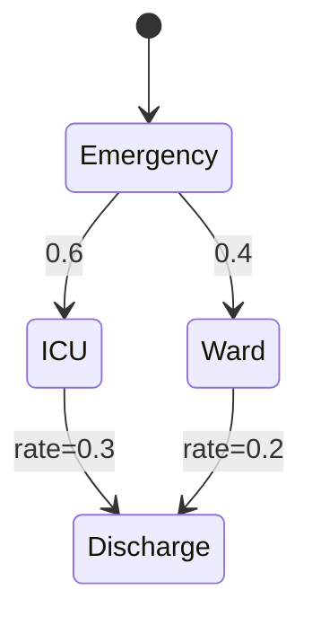

## 引言

PRISM（Probabilistic Symbolic Model Checker）是一种用于建模和分析概率系统的工具，在医疗系统领域具有广泛的应用。通过PRISM，我们可以对医疗流程、药物疗效、疾病传播等场景进行形式化建模，并量化分析其可靠性和风险。本章将介绍PRISM在医疗系统中的典型应用方法。

:::note 为什么选择PRISM？
- 能处理**概率性**（如治疗成功率）和**时序性**（如药物代谢周期）
- 支持**连续时间马尔可夫链**(CTMC)等医疗常用模型
- 可验证系统是否满足**概率时序逻辑**规范
:::

## 基础建模方法

### 1. 医疗流程建模
用离散时间马尔可夫链(DTMC)表示诊疗路径：

```prism
// 癌症治疗路径模型
dtmc

module Patient
    state : [0..3] init 0; // 0:诊断 1:化疗 2:手术 3:康复
    [diagnose] state=0 -> 0.9: (state'=1) + 0.1: (state'=0);
    [chemo] state=1 -> 0.7: (state'=2) + 0.3: (state'=1);
    [surgery] state=2 -> 0.8: (state'=3) + 0.2: (state'=0);
endmodule
```

### 2. 药物相互作用分析
使用连续时间马尔可夫链(CTMC)建模：

```prism
// 药物A和B的代谢相互作用
ctmc

const double k_A = 0.2; // 药物A代谢率
const double k_B = 0.3; // 药物B单独代谢率
const double k_AB = 0.1; // 药物相互作用系数

module Drug
    [administer_A] true -> k_A: true;
    [administer_B] true -> k_B: true;
    [interact] true -> k_AB: true;
endmodule
```

## 典型应用场景

### 1. 治疗方案评估
**问题**：比较两种糖尿病治疗方案的成功概率<br />
**方法**：
```prism
// 查询3个月内血糖控制达标概率
P=? [ F<=90 days (glucose_level < 7.0) ]
```

### 2. 医院资源优化
使用**概率定时自动机**(PTA)模型：



对应的PRISM属性验证：
```prism
// 验证48小时内出院概率
P>=0.8 [ F<=48h (state=Discharge) ]
```

## 实际案例研究

### 案例：ICU感染控制
**模型要素**：
1. 患者状态：`S(易感)` → `I(感染)` → `R(康复)`
2. 感染率：`λ = 0.05`（每床位每天）
3. 消毒效果：降低感染率至`λ' = 0.01`

**PRISM实现**：
```prism
const int N = 10; // 床位数
const double lambda = 0.05;
const double lambda_prime = 0.01;

module ICU
    infected : [0..N] init 0;
    [clean] true -> 1.0: true; // 消毒事件
    [infect] (disinfected=false) -> infected*lambda : (infected'=min(infected+1,N));
    [infect] (disinfected=true) -> infected*lambda_prime : (infected'=min(infected+1,N));
endmodule
```

**关键分析**：
```prism
// 一周内爆发感染(>3例)的概率
P=? [ F<=168h infected>3 ]
```

## 总结与练习

### 核心要点
- PRISM可对医疗系统的**概率行为**进行形式化验证
- 常用模型包括DTMC（离散决策）、CTMC（连续过程）
- 典型分析包括**成功率验证**和**资源优化**

### 实践练习
1. 为门诊流程建模，包含"挂号→检查→诊断→取药"四个状态，假设每个环节有10%的流失率
2. 编写PRISM属性验证"90%的患者能在2小时内完成就诊"
3. 扩展ICU模型，加入医护人员传播因素

### 扩展资源
- 《医疗系统形式化方法》(Formal Methods in Healthcare)
- PRISM官方案例库中的`hospital`案例
- 国际医疗系统验证研讨会(HProHealth)论文集
