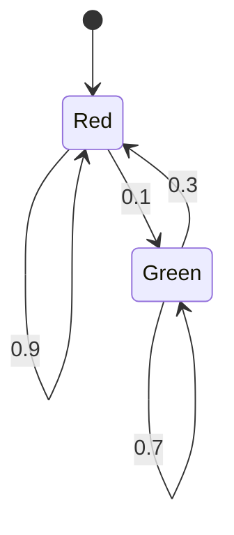

# PRISM 交通系统建模

## 简介

PRISM（Probabilistic Symbolic Model Checker）是一个用于建模和分析概率系统的工具，广泛应用于交通系统的形式化验证。通过PRISM，我们可以对交通流、信号灯控制、车辆行为等场景建立概率模型，并验证其可靠性、效率等属性。

交通系统通常涉及以下特点：
- **不确定性**：车辆到达时间、驾驶员行为等具有随机性
- **并发性**：多车辆同时交互
- **时间约束**：信号灯时序、车辆通行时间等

PRISM的**离散时间马尔可夫链(DTMC)**和**连续时间马尔可夫链(CTMC)**特别适合这类建模需求。

## 基础概念

### 1. 交通系统组件建模

典型的交通系统PRISM模型包含以下元素：

```prism
// 信号灯状态
module TrafficLight
    state : [0..2]; // 0=红, 1=黄, 2=绿
    
    [tick] state=0 -> 0.9 : (state'=0) + 0.1 : (state'=1); // 红灯保持或变黄
    [tick] state=1 -> 1 : (state'=2); // 黄灯必变绿
    [tick] state=2 -> 0.7 : (state'=2) + 0.3 : (state'=0); // 绿灯保持或变红
endmodule
```

### 2. 车辆流建模

```prism
module VehicleFlow
    cars : [0..10]; // 路口等待车辆数
    
    [arrive] true -> lambda : (cars'=min(cars+1,10)); // 车辆到达率λ
    [depart] cars>0 & light=green -> mu : (cars'=cars-1); // 车辆离开率μ
endmodule
```

## 实际案例：交叉路口信号灯控制

### 问题描述
分析一个双向交叉路口的信号灯时序方案，验证：
1. 车辆平均等待时间不超过3分钟
2. 系统不会出现双向绿灯冲突

### PRISM 模型实现

```prism
// 双向信号灯模型
ctmc

const double lambda1 = 0.3; // 方向1车辆到达率
const double lambda2 = 0.2; // 方向2车辆到达率
const double mu = 0.5;     // 车辆通过率

module Direction1
    q1 : [0..5]; // 方向1排队车辆数
    [arrive1] true -> lambda1 : (q1'=min(q1+1,5));
    [depart1] q1>0 & light1=green -> mu : (q1'=q1-1);
endmodule

module Direction2
    q2 : [0..5]; // 方向2排队车辆数
    [arrive2] true -> lambda2 : (q2'=min(q2+1,5));
    [depart2] q2>0 & light2=green -> mu : (q2'=q2-1);
endmodule

module Lights
    light1 : [0..1]; // 0=red, 1=green
    light2 : [0..1];
    
    // 确保不会同时绿灯
    invariant (light1=1 => light2=0) & (light2=1 => light1=0)
    
    // 信号灯周期切换
    [switch] true -> 0.1 : (light1'=1-light1) & (light2'=1-light2);
endmodule
```

### 属性验证

```prism
// 平均等待时间检查
R{"wait_time"}<=3 [ S ]

// 安全属性：永远不会双向绿灯
P>=1 [ G !(light1=1 & light2=1) ]
```

## 可视化分析



## 进阶应用：智能交通系统

现代智能交通系统可以结合PRISM进行更复杂的分析：

1. **自适应信号控制**：根据实时交通流调整信号时序
   ```prism
   [adjust] q1>threshold -> priority : (light1'=1) & (light2'=0);
   ```

2. **应急车辆优先**：建模救护车等特殊车辆的优先通行逻辑
   ```prism
   [emergency] true -> 0.01 : (priority'=1);
   ```

3. **车联网协同**：多智能体车辆交互模型
   ```prism
   module Car1
       pos : [0..100];
       [move] light=green -> v1 : (pos'=min(pos+1,100));
   endmodule
   ```

## 总结与练习

### 关键要点
- PRISM可有效建模交通系统中的随机性和时间特性
- DTMC/CTMC适合描述车辆到达、离开等概率事件
- 可以验证性能指标（等待时间）和安全属性（冲突避免）

### 推荐练习
1. 扩展交叉路口模型，增加左转专用信号相位
2. 为应急车辆添加优先通行逻辑，并验证其对普通车辆的影响
3. 尝试用PRISM-GUI可视化不同参数下的系统行为

### 延伸阅读
- PRISM官方文档中的"Case Studies → Randomized Consensus"
- 《Formal Methods for Performance Evaluation》第7章交通系统应用
- 智能交通系统(ITS)中的概率模型研究论文