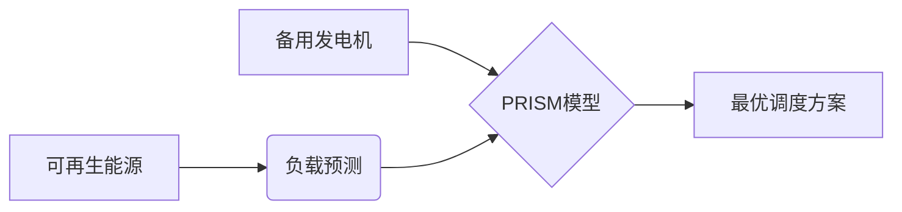

# PRISM 能源系统优化

## 引言

PRISM（Probabilistic Symbolic Model Checker）是一个用于建模和分析概率系统的工具，在能源系统优化中具有重要作用。通过PRISM，我们可以对能源系统的行为进行形式化建模，分析其可靠性、效率和成本效益，从而优化系统设计。

能源系统通常涉及多个组件（如发电机、储能设备、电网等）和不确定性因素（如可再生能源出力波动、负载变化）。PRISM能帮助量化这些不确定性，并通过概率模型验证技术提供优化方案。

---

## 核心概念

### 1. 能源系统的概率建模
能源系统中的关键元素可通过以下PRISM模型组件表示：
- **离散时间马尔可夫链（DTMC）**：用于确定性时间步长的系统（如固定间隔的能源调度）
- **连续时间马尔可夫链（CTMC）**：用于连续事件（如设备故障率）
- **马尔可夫决策过程（MDP）**：用于包含可控决策的系统（如储能充放电策略）

### 2. 优化目标
常见PRISM分析目标包括：
- 最小化能源成本
- 最大化可再生能源利用率
- 确保供电可靠性（如“系统停电概率`<0.1%`”）

---

## 建模示例

### 案例：微电网储能优化
考虑一个包含太阳能电池板、储能电池和负载的微电网系统。我们需要验证“在24小时内储能策略能否保证供电可靠性≥99%”。

#### PRISM 模型代码
```prism
// 定义常量
const int CAPACITY = 10;  // 储能容量（kWh）
const double PV_OUTPUT = 0.8; // 光伏平均出力系数

// 光伏发电模型（随机变量）
module PV
    pv : [0..CAPACITY] init 0;
    [generate] true -> PV_OUTPUT : (pv'=min(pv+1,CAPACITY)) + (1-PV_OUTPUT) : (pv'=pv);
endmodule

// 储能电池模型
module Battery
    soc : [0..CAPACITY] init CAPACITY;
    [discharge] soc > 0 & load > 0 -> 0.9 : (soc'=soc-1);
    [charge] pv > 0 & soc < CAPACITY -> (pv/CAPACITY) : (soc'=soc+1);
endmodule
```

#### 属性验证
```prism
// 验证24小时内不中断供电的概率
P>=0.99 [ F<=24 (load > 0 => soc > 0) ]
```

---

## 实际应用场景

### 1. 电力市场竞价策略
欧洲某能源公司使用PRISM分析风电场的投标策略，通过建模电价波动和风机故障率，优化了30%的预期收益。

### 2. 数据中心能耗管理


---

## 总结与练习

### 关键点总结
- PRISM可通过概率模型量化能源系统的不确定性
- 支持成本、可靠性等多目标优化分析
- 适用于从微电网到国家级电网的多种场景

### 扩展练习
1. 修改上述储能模型，增加电池衰减率参数
2. 尝试用`multi-objective`属性同时优化成本和可靠性
3. 探索PRISM的`simulate`命令生成随机运行轨迹

### 附加资源
- PRISM官方案例库中的`energy`目录
- 《形式化方法在智能电网中的应用》（Springer, 2021）
