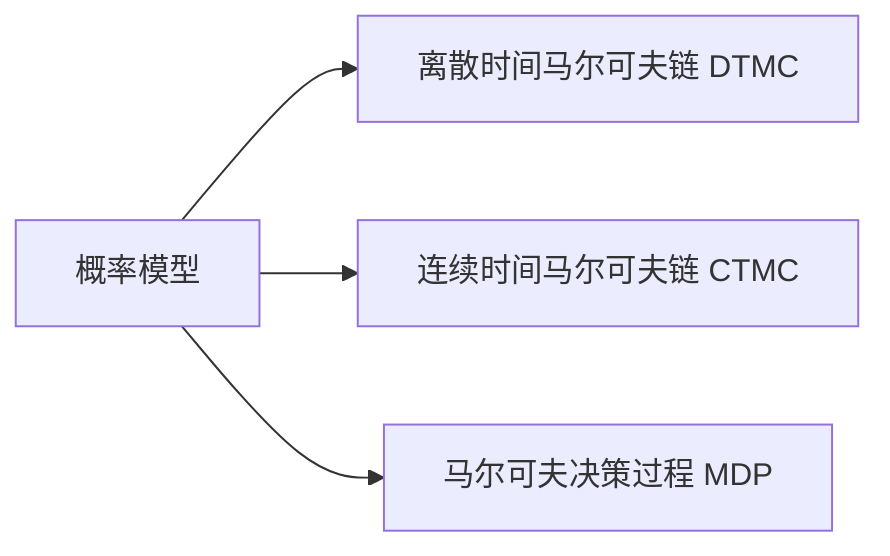

## 引言

模型检测（Model Checking）是一种自动化的形式化验证技术，用于验证系统模型是否满足特定性质（如安全性、活性）。PRISM（Probabilistic Symbolic Model Checker）是专为**概率系统**设计的模型检测工具，能够分析马尔可夫链等随机模型。本章将介绍PRISM背后的模型检测理论基础，并通过实例演示其应用。

---

## 模型检测基础

### 什么是模型检测？
模型检测通过以下步骤验证系统：
1. **建模**：将系统抽象为状态转换模型（如有限状态机）。
2. **规约**：用逻辑公式（如时态逻辑）描述待验证性质。
3. **验证**：算法遍历模型状态空间，检查性质是否全局成立。

### PRISM 的扩展
PRISM在传统模型检测基础上增加了对**概率行为**的支持，可验证：
- 概率性性质（如“任务成功率≥90%”）
- 期望值性质（如“平均能耗≤5焦耳”）

---

## PRISM 的核心理论

### 1. 概率模型
PRISM支持三类主要模型：


### 2. 概率时态逻辑
PRISM使用**PCTL**（概率计算树逻辑）和**CSL**（连续随机逻辑）描述性质，例如：
- `P≥0.9 [F "success"]`：最终成功的概率≥90%
- `R{"energy"}≤5 [F completed]`：完成任务的期望能耗≤5

---

## 实例分析：简单通信协议

### 建模
假设一个数据包传输协议，成功概率为80%，失败后重试。用PRISM的DTMC模型描述：
```prism
dtmc

module Sender
    state : [0..2] init 0;  // 0:准备, 1:发送, 2:成功
    [send] state=0 -> 0.8: (state'=1) + 0.2: (state'=0);
    [retry] state=1 -> 0.8: (state'=2) + 0.2: (state'=0);
endmodule
```

### 验证性质
检查“最终成功概率是否为1”：
```prism
P=? [ F state=2 ]
```
**输出结果**：`Result: 1.0` （因为无限重试总能成功）

---

## 实际应用场景

### 案例：自动驾驶决策
验证自动驾驶汽车在交叉路口的碰撞概率：
1. **建模**：用MDP表示车辆动作（加速/减速）和环境不确定性。
2. **性质**：`P≤0.001 [ F collision ]`（碰撞概率≤0.1%）
3. **结果**：PRISM可识别导致高风险的参数组合。

:::tip 工业应用
PRISM已被用于验证：
- 网络安全协议
- 医疗设备故障概率
- 分布式系统容错机制
:::

---

## 总结

| 关键点                  | 说明                                                                 |
|-------------------------|----------------------------------------------------------------------|
| **概率模型**            | DTMC/CTMC/MDP描述系统随机行为                                       |
| **形式化规约**          | PCTL/CSL表达概率性和期望性质                                        |
| **自动化验证**          | PRISM通过数值计算或模拟得出精确结果                                 |

---

## 延伸学习

### 练习建议
1. 在PRISM中建模一个掷骰子游戏，验证“点数和≥10的概率”。
2. 尝试用CSL公式描述“系统在5秒内响应的概率”。

### 推荐资源
- 《Principles of Model Checking》（Christel Baier等）
- PRISM官方文档中的[Tutorials](https://www.prismmodelchecker.org/tutorial/)
