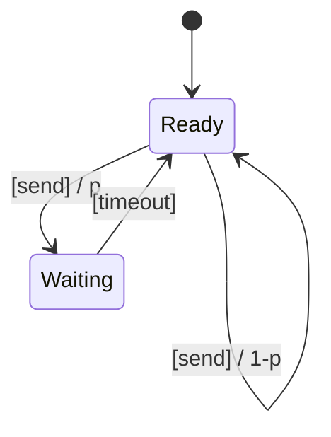

## 引言

过程代数（Process Algebra）是描述并发系统行为的数学框架，而PRISM是一个支持概率模型检查的工具。本章将介绍如何利用过程代数的概念在PRISM中建模系统，并通过概率模型验证其性质。我们将从基础概念出发，逐步展示实际建模示例。

:::note 关键术语
- **过程代数**：如CSP、CCS、π演算，用于描述并发进程的交互。
- **PRISM**：支持离散/连续时间马尔可夫链（DTMC/CTMC）和马尔可夫决策过程（MDP）的模型检查器。
:::

---

## 过程代数基础

过程代数的核心是通过**动作**和**组合算子**描述系统行为。例如：
- **动作前缀（`→`）**：`a → P` 表示执行动作`a`后转为进程`P`。
- **选择（`+`）**：`P + Q` 表示在`P`和`Q`之间非确定性选择。
- **并行组合（`||`）**：`P || Q` 表示`P`和`Q`并发执行。

在PRISM中，这些概念被转化为状态和转移的概率描述。

---

## PRISM 中的过程代数建模

### 示例：简单的并行系统
考虑两个进程`A`和`B`通过动作`sync`同步，用PRISM的MDP模型描述如下：

```prism
mdp

module ProcessA
    stateA: [0..1] init 0;
    [a] stateA=0 → 0.9: (stateA'=1) + 0.1: (stateA'=0);
    [sync] stateA=1 → (stateA'=0);
endmodule

module ProcessB
    stateB: [0..1] init 0;
    [b] stateB=0 → (stateB'=1);
    [sync] stateB=1 → (stateB'=0);
endmodule
```

**解释**：
- 进程`A`以概率0.9执行动作`a`并进入状态`1`，或保持状态（概率0.1）。
- 进程`B`确定性地执行动作`b`。
- 两者通过`[sync]`同步后重置状态。

---

## 实际案例：通信协议

### 问题描述
建模一个简单的重传协议，其中：
1. 发送方以概率`p`成功发送消息，否则超时并重试。
2. 接收方可能丢失消息（概率`q`）。

### PRISM 代码
```prism
dtmc

module Sender
    s: [0..1] init 0; // 0=ready, 1=waiting
    [send] s=0 → p: (s'=0) + (1-p): (s'=1); // 成功或超时
    [timeout] s=1 → (s'=0); // 重试
endmodule

module Receiver
    r: [0..1] init 0; // 0=idle, 1=received
    [send] r=0 → q: (r'=0) + (1-q): (r'=1); // 丢失或接收
    [reset] r=1 → (r'=0);
endmodule
```

### 分析性质
验证“消息最终被接收的概率”：
```prism
P=? [ F r=1 ]
```

---

## 可视化：状态转移图



---

## 总结

1. **过程代数**为PRISM提供了并发建模的理论基础。
2. **并行模块**和**同步动作**是PRISM实现过程代数的关键机制。
3. 概率扩展允许对不确定性进行量化分析。

:::tip 练习
1. 修改上述通信协议，增加一个中间路由器（概率转发）。
2. 使用PRISM验证“发送方超时次数不超过3次”的概率。
:::

**扩展阅读**：
- 《Principles of Model Checking》第10章（过程代数与模型检查）。
- PRISM官方文档中的“Parallel Composition”部分。