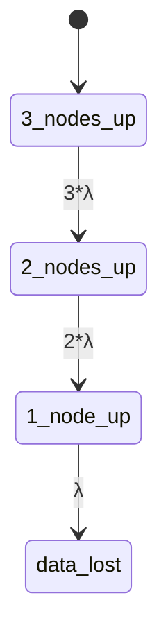

## 引言

正确性证明是形式化方法的核心目标之一，它通过数学手段验证系统是否满足预期规范。PRISM作为**概率符号模型检测器**，能够对随机性系统（如通信协议、随机化算法）进行自动化验证。本章将介绍如何用PRISM建立模型并证明其性质，涵盖概率计算树逻辑（PCTL）规范、模型检查流程及实际案例。

## 基本概念

### 1. 什么是正确性证明？
在形式化验证中，正确性证明指通过逻辑推理或模型检测，确保系统在所有可能场景下均满足：
- **安全性**（如"永不发生死锁"）
- **活性**（如"请求最终会被响应"）
- **概率性质**（如"消息在99%情况下能在1秒内送达"）

PRISM通过以下步骤实现证明：
1. 将系统建模为**马尔可夫链**（DTMC/CTMC/MDP）
2. 用**PCTL**或**CSL**语言描述待验证性质
3. 自动计算性质成立的概率或期望值

### 2. PCTL语法示例
PRISM使用PCTL表达概率性质，基本结构如下：

```prism
P>=0.99 [ F "success" ]  // "最终达到success状态的概率≥99%"
E<=5 [ F "done" ]        // "期望到达done状态的步数≤5"
```

## 操作流程

### 步骤1：建立PRISM模型
以简单的重传协议为例，定义发送消息的成功概率为0.8：

```prism
dtmc

module Sender
  state : [0..2] init 0;  // 0=准备, 1=发送, 2=成功
  [send] state=0 -> 0.8:(state'=1) + 0.2:(state'=0);
  [retry] state=1 -> 0.8:(state'=2) + 0.2:(state'=0);
endmodule
```

### 步骤2：定义待验证性质
验证"在3次重传内成功"的概率：

```prism
P>=0.95 [ F<=3 state=2 ]
```

### 步骤3：运行验证
PRISM输出结果：

```text
Result: 0.94208 (实际满足概率94.2%，不满足要求)
```

:::tip 调试建议
当性质不满足时，可通过PRISM的**模拟器**生成反例路径，或调整模型参数（如提高重传成功率）。
:::

## 实际案例：云存储系统

### 问题描述
验证一个分布式存储系统的数据可靠性，要求：
- 单节点故障率5%
- 三副本条件下数据丢失概率`<0.001%`

### PRISM 模型片段
```prism
ctmc

const int N = 3; // 副本数
const double lambda = 0.05; // 故障率

module Node
  [fail] up -> lambda : down;
endmodule

// 系统状态=存活节点数
formula alive = (node1.up + node2.up + node3.up);
```

### 验证性质
```prism
P<=0.00001 [ F alive < N/2 ]
```



## 总结

通过PRISM进行正确性证明的关键步骤：
1. **建模**：将系统抽象为概率模型
2. **规约**：用PCTL/CSL描述性质
3. **验证**：自动计算性质成立概率
4. **优化**：根据结果改进系统设计

:::note 扩展练习
1. 修改重传协议模型，使得在5次尝试内成功率`≥99%`
2. 尝试为M/M/1队列系统验证平均响应时间上限
:::

## 附加资源
- PRISM官方文档：[概率性质语法](https://www.prismmodelchecker.org/manual/PropertySpecification/)
- 教材推荐：《Principles of Model Checking》第10章