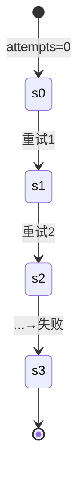

# PRISM 与反例生成

## 引言

在形式化方法中，**反例生成**是模型检测的核心功能之一。当PRISM验证某个属性不成立时（例如“系统永远不会死锁”），它会生成一个**反例**（Counterexample）——即一条具体的执行路径，展示属性如何被违反。理解反例有助于调试系统设计中的逻辑错误。

## 反例的基本概念

反例通常表现为：
1. **路径反例**：状态转换序列（适用于线性时序逻辑属性）。
2. **策略反例**：在概率模型中，展示导致属性违反的决策组合。

:::tip 为什么需要反例？
反例将抽象的验证失败转化为具体可调试的案例，例如：
- 展示死锁发生的步骤
- 揭示概率属性未达预期的关键路径
:::

## 在PRISM中生成反例

### 步骤1：验证属性
假设我们有一个简单的DTMC模型（保存为 `example.prism`）：
```prism
dtmc

module M
  s : [0..2] init 0;
  [] s=0 -> 0.5: (s'=1) + 0.5: (s'=2);
  [] s=1 -> 1: (s'=0);
  [] s=2 -> 1: (s'=0);
endmodule

// 验证“最终永远停留在s=1”的概率
P=? [ F G s=1 ]
```

### 步骤2：启用反例生成
在PRISM命令行中添加 `-exportcounterexample` 参数：
```bash
prism example.prism -pf "P=? [ F G s=1 ]" -exportcounterexample 1
```

### 步骤3：分析输出
PRISM会生成：
1. **文本反例**：在终端显示关键路径
2. **图形化反例**（可选）：通过 `-exportstatemachine` 导出为Dot格式

示例输出可能包含：
```
Counterexample for P=? [ F G s=1 ]:
Path probability: 0.5
States: 0 -> 1 -> 0 -> 1 -> ...
```

## 实际案例：通信协议超时

考虑一个重传协议模型，验证“消息最终必达”：
```prism
// 模型片段
const int K; // 最大重试次数
formula done = (attempts >= K);

module Sender
  attempts : [0..K] init 0;
  [] !done -> 0.9: (attempts'=attempts+1) + 0.1: (attempts'=0);
endmodule

// 验证属性
P>=1 [ F attempts=0 ]
```

当该属性不成立时，反例会显示：
- 所有重试均失败的路径（概率虽低但存在）
- 关键参数 `K` 的设置问题

## 反例的可视化

使用Mermaid展示反例路径：


## 总结

反例生成帮助您：
- 定位设计缺陷
- 理解概率模型的边界情况
- 优化系统参数（如超时阈值）

## 延伸练习

1. 在PRISM GUI中加载[投票协议案例](http://www.prismmodelchecker.org/casestudies/voting.php)，尝试生成反例
2. 修改本文的DTMC示例，使得 `P=? [ F G s=1 ]` 的概率为0，观察反例变化

## 附加资源

- PRISM手册：[Counterexample Generation章节](http://prismmodelchecker.org/manual/)
- 推荐阅读：《Principles of Model Checking》第10章