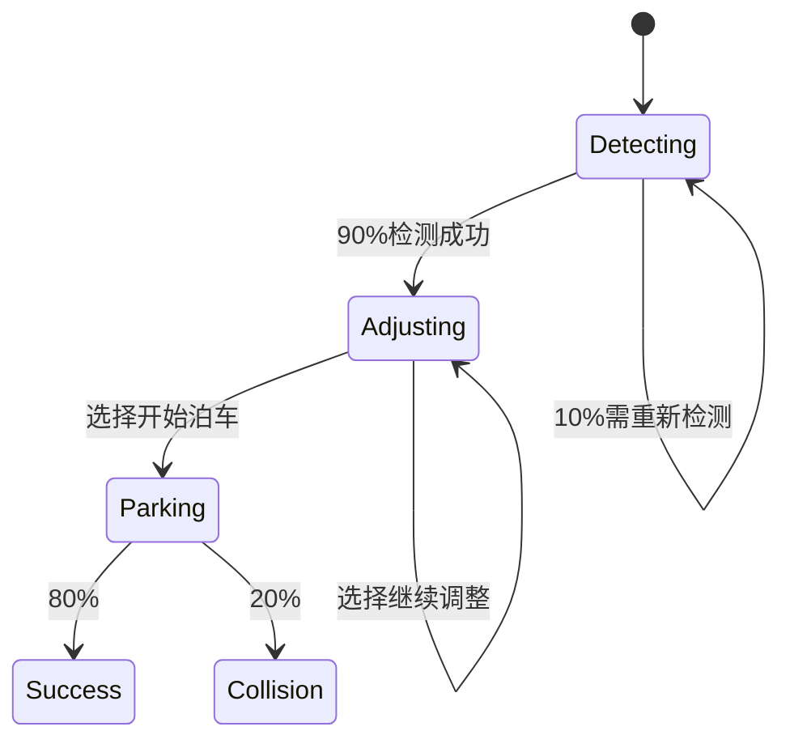

## 引言

PRISM作为概率模型检测工具，不仅能验证系统属性，还可用于**自动化测试生成**。通过将系统建模为概率模型（如DTMC、CTMC或MDP），PRISM可计算特定场景的发生概率，并据此生成高覆盖率的测试用例。本章将介绍如何利用PRISM生成测试用例，并通过实际案例展示其在软件测试中的应用。

## 核心概念

### 1. 测试生成的基本原理
PRISM通过以下步骤生成测试用例：
1. **建模**：将待测系统抽象为概率模型（如DTMC）。
2. **属性定义**：用PCTL（概率计算树逻辑）描述需要覆盖的测试目标。
3. **分析**：PRISM计算满足属性的路径及其概率。
4. **路径提取**：将高概率路径转化为可执行的测试用例。

:::tip
测试生成特别适用于**关键路径验证**，例如安全协议中的错误恢复流程或机器人决策逻辑。
:::

### 2. PRISM模型示例
以下是一个简单的DTMC模型，描述网络连接的重试机制：

```prism
dtmc

module Connection
  state: [0..3] init 0;  // 0:断开, 1:连接中, 2:成功, 3:失败
  attempt: [0..2] init 0;

  [] state=0 -> 0.8: (state'=1) + 0.2: (state'=0);  // 发起连接或保持断开
  [] state=1 -> 0.7: (state'=2) + 0.3: (state'=3);  // 连接成功或失败
  [] state=3 & attempt<2 -> 0.9: (state'=1) & (attempt'=attempt+1) + 0.1: (state'=0);
endmodule
```

### 3. 定义测试目标
在PRISM中通过PCTL指定测试关注点：

```prism
// 检查"最终连接成功"的概率
P=? [ F state=2 ]

// 检查"重试不超过两次即成功"的概率
P=? [ F<=3 state=2 ]
```

运行PRISM分析后，可得到各路径的概率分布，优先选择概率>0.1的路径作为测试用例。

## 实际案例：自动泊车系统

### 模型描述
考虑一个自动泊车系统的简化MDP模型：
- **状态**：检测车位、调整位置、泊车中、成功/失败
- **动作**：继续调整、开始泊车
- **概率**：传感器误检概率0.1



### 测试生成步骤
1. 关键属性验证：
   ```prism
   // 碰撞概率必须<5%
   Pmax=? [ F "Collision" ]
   ```
2. PRISM输出显示`Pmax=0.072`，需进一步测试以下场景：
   - 连续两次传感器误检
   - 泊车过程中遇到障碍物

## 进阶技巧

### 1. 覆盖率导向的生成
通过组合以下属性提高测试覆盖率：
```prism
// 覆盖所有状态
filter(state, P=? [ F state=s ], s=0..3)

// 覆盖边界情况
P=? [ F (attempt=2 & state=3) ]
```

### 2. 与模拟器集成
将PRISM生成的路径转化为测试脚本（Python示例）：
```python
def test_retry_scenario():
    for _ in range(2):  # PRISM 建议的重试次数
        result = connect()
        if result == "SUCCESS":
            break
    assert result == "SUCCESS"
```

## 总结

| 方法              | 适用场景                  | PRISM优势               |
|-------------------|--------------------------|-------------------------|
| 概率路径分析       | 关键流程验证              | 量化风险优先级          |
| 边界值生成         | 异常处理测试              | 自动识别低概率路径      |
| 组合属性覆盖       | 全状态覆盖                | 形式化保证覆盖率        |

## 练习与资源

1. **动手实验**：在PRISM中建模一个简单的登录系统（3次重试限制），生成测试用例。
2. **扩展阅读**：
   - 《Principles of Model Checking》第10章
   - PRISM官方文档中的"Path Generation"章节
3. **思考题**：如何用PRISM测试生成替代传统的边界值分析？

:::caution
实际应用中需注意：
- 模型复杂度可能导致状态爆炸
- 概率参数的准确性影响测试有效性
::/