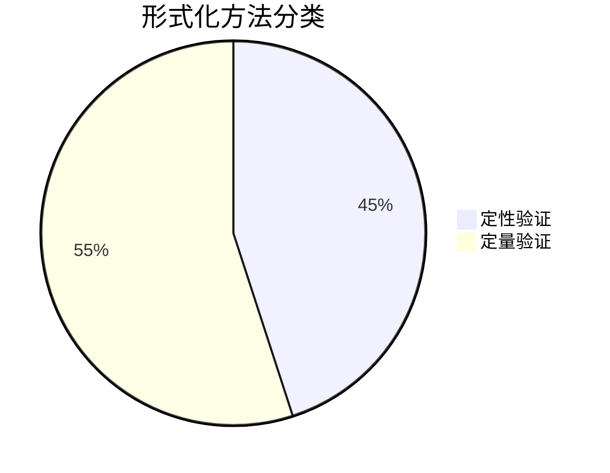

## 引言

形式化方法是用于验证系统正确性的数学技术，而PRISM（Probabilistic Symbolic Model Checker）是其中专注于**概率系统验证**的工具。本章将对比PRISM与其他形式化方法（如模型检测、定理证明等）的异同，帮助初学者理解如何根据需求选择合适的技术。

## 核心概念对比

### 1. 形式化方法分类
形式化方法主要分为两类：
- **定性方法**：验证系统是否满足特定性质（如"死锁不会发生"）
  - 示例工具：SPIN (模型检测)、Alloy (轻量级形式化建模)
- **定量方法**：计算满足性质的概率或期望值
  - 示例工具：PRISM、Storm



### 2. PRISM的独特优势
PRISM的核心特点是：
- 支持**概率模型**（DTMC/CTMC/MDP）
- 提供**概率计算语言**（PCTL/CSL）
- 内置**符号化计算引擎**

:::tip 实际案例
验证无线通信协议时：
- 定性方法只能判断"消息最终能否到达"
- PRISM可以计算"消息在5秒内到达的概率为98.7%"
:::

## 技术对比表格

| 特性               | PRISM           | 传统模型检测 (如SPIN) | 定理证明 (如Coq) |
|--------------------|-----------------|----------------------|-----------------|
| 验证类型           | 定量            | 定性                 | 定性            |
| 自动化程度         | 高              | 高                   | 低              |
| 学习曲线           | 中等            | 低                   | 高              |
| 适用系统           | 随机/概率系统   | 并发系统             | 任何数学系统    |

## 代码示例对比

### PRISM 概率验证示例
验证"硬币连续3次正面的概率"：
```prism
dtmc

module coin_flip
    state : [0..3] init 0;
    flip : bool init false;
    
    [] state=0 -> 0.5 : (state'=1) + 0.5 : (state'=0);
    [] state=1 -> 0.5 : (state'=2) + 0.5 : (state'=0);
    [] state=2 -> 0.5 : (state'=3) + 0.5 : (state'=0);
endmodule

// 计算P=? [ F state=3 ]
```
输出结果：`Probability: 0.125`

### SPIN非概率验证示例
验证"互斥锁的正确性"：
```promela
bool lock = false;
active [2] proctype user() {
    do
    :: !lock -> 
        lock = true;
        /* 临界区 */
        lock = false
    od
}
```
输出结果：`verification: no deadlocks`

## 典型应用场景

### 适合PRISM的场景
1. **网络协议分析**：计算数据包丢失概率
2. **生物系统建模**：分子交互概率模拟
3. **硬件可靠性**：芯片故障率预测

### 适合其他方法的场景
1. **操作系统验证**：使用SPIN验证调度算法
2. **编译器正确性**：使用Coq证明程序转换等价性

:::caution 注意
PRISM不适合验证：
- 非概率性需求（如"必须永不发生"）
- 无限状态系统（需抽象化处理）
:::

## 总结与练习

### 关键结论
- 选择PRISM当需要**量化概率/时间属性**
- 选择传统模型检测当需要**快速定性验证**
- 选择定理证明当需要**数学严谨性**

### 练习建议
1. 用PRISM建模简单的交通灯系统，计算两灯同时绿的概率
2. 尝试用SPIN验证同一系统的死锁自由度
3. 比较两种工具的输出差异

### 扩展阅读
- PRISM官方教程：http://www.prismmodelchecker.org/tutorial/
- 《形式化方法基础》（教材）
- 模型检测对比论文：Clarke et al. "Model Checking"