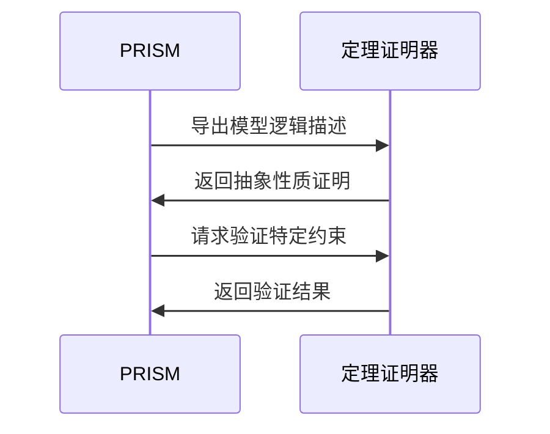

## 引言

**定理证明**是形式化方法中通过数学逻辑验证系统正确性的核心技术。PRISM作为概率模型检测工具，虽然主要基于模型检测（自动遍历状态空间），但能与定理证明互补：  
- **模型检测**：适用于有限状态系统，自动验证属性（如"系统永不死锁"）。  
- **定理证明**：处理无限状态或抽象系统，通过逻辑推导证明性质（如"算法最终收敛"）。  

本章将展示PRISM如何结合定理证明技术增强验证能力。

## PRISM 中的逻辑基础

PRISM的属性规约使用**概率时序逻辑**（如PCTL、CSL），其语法与定理证明中使用的逻辑系统（如一阶逻辑、霍尔逻辑）有共通之处。例如：

```prism
// PRISM的PCTL公式："在初始状态下，最终达到目标状态的概率≥0.95"
P≥0.95 [ F "goal" ]
```

对应的逻辑表达式可能为：
```
∀s ∈ InitialStates, ∃路径 s→s₁→...→sₙ, sₙ ⊨ goal ∧ P(path) ≥ 0.95
```

## 结合定理证明的典型场景

### 1. 抽象模型验证
当PRISM模型状态空间过大时，可通过定理证明验证抽象模型的性质，再映射回具体模型。例如：


### 2. 归纳性质证明
对于参数化系统（如N个进程的协议），PRISM只能验证固定N值，而定理证明能通过数学归纳法证明∀N的性质：

```prism
// 归纳基础：验证N=1时性质成立
// 归纳步骤：假设N=k成立，证明N=k+1成立
```

### 3. 混合验证案例
**案例：分布式共识协议**  
- 用PRISM验证小规模场景下的概率性质（如"5节点下达成共识的概率"）。  
- 用定理证明（如Isabelle/HOL）验证协议的核心逻辑正确性（如"提案编号唯一"）。  

:::tip 实际代码示例
PRISM验证部分属性（LTL公式）：
```prism
// 共识协议中"所有节点最终决定相同值"的概率
P≥0.99 [ G (decision1 = decision2 = ... = decisionN) ]
```
:::

## 工具链集成示例

PRISM可与定理证明器（如PVS、Coq）协同工作。典型流程：

1. **模型转换**：将PRISM模型导出为逻辑描述（如HOL格式）。  
2. **性质分解**：  
   - 用PRISM验证可自动化的部分（如概率计算）。  
   - 用定理证明器验证抽象性质（如不变式）。  



## 总结与练习

### 关键点总结
- **互补性**：PRISM适合自动化验证具体实例，定理证明处理抽象和无限状态。  
- **逻辑桥梁**：PCTL/CSL公式可转换为逻辑命题供证明器使用。  
- **混合验证**：结合两者优势应对复杂系统（如分布式协议）。  

### 练习建议
1. 在PRISM中建模一个简单互斥协议，尝试用LTL表达"无死锁"性质。  
2. 将其中一个性质（如"临界区互斥"）手动转化为一阶逻辑命题。  
3. 研究PRISM的`--export`参数，了解模型导出格式。  

### 扩展阅读
- 《Formal Methods for Probabilistic Systems》 - PRISM官方文档第6章  
- 《Interactive Theorem Proving and Program Development》 - Coq教材