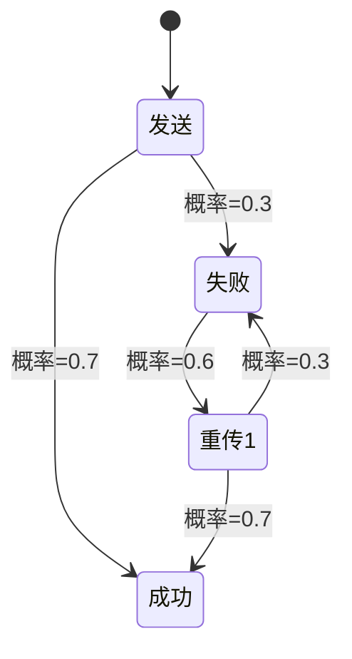

# PRISM 与软件验证

## 引言

PRISM（Probabilistic Symbolic Model Checker）是一个开源的**概率模型检测工具**，专为分析随机性和不确定性系统设计。在软件验证领域，PRISM通过形式化方法帮助开发者验证系统是否满足关键性质（如可靠性、安全性），尤其适用于**概率性行为**的系统（如通信协议、随机算法）。

## 为什么需要PRISM进行软件验证？

传统测试方法可能无法覆盖所有边界情况，而PRISM通过以下方式增强验证：
1. **数学严谨性**：基于概率模型检查（Probabilistic Model Checking）理论。
2. **自动化分析**：自动计算满足特定性质的概率或期望值。
3. **场景覆盖**：处理非确定性（Nondeterminism）和随机性（如马尔可夫链）。

---

## 核心概念

### 1. 概率模型
PRISM支持三类模型：
- **离散时间马尔可夫链（DTMC）**：纯概率系统。
- **连续时间马尔可夫链（CTMC）**：带时间延迟的概率系统。
- **马尔可夫决策过程（MDP）**：结合非确定性和概率。

### 2. 性质规约
使用**PCTL**（概率计算树逻辑）或**CSL**（连续随机逻辑）描述待验证性质。例如：
```prism
P>=0.99 [ F "任务完成" ]  // "任务完成"最终发生的概率≥99%
```

---

## 实战示例：验证缓存一致性协议

### 步骤1：建模（DTMC）
以下是一个简化的缓存模型，描述数据同步概率：
```prism
dtmc

module Cache
  state : [0..2] init 0;  // 0=无效, 1=有效, 2=已更新
  [sync] state=0 -> 0.9 : state'=1 + 0.1 : state'=0;
  [update] state=1 -> 0.8 : state'=2;
endmodule
```

### 步骤2：定义验证目标
检查“数据最终一致”的概率：
```prism
P=? [ F state=2 ]
```

### 步骤3：运行与分析
PRISM输出结果：
```plaintext
Result: 0.888... (约88.9%)
```

:::tip 解读
模型有约11.1%的概率无法达成一致，可能需要优化同步机制。
:::

---

## 实际应用场景

### 案例：物联网设备通信
- **问题**：无线传感器网络存在丢包风险。
- **PRISM方案**：
  1. 建模信道丢包率为DTMC。
  2. 验证“消息在3次重传内成功”的概率：
     ```prism
     P>=0.95 [ F<=3 传输成功 ]
     ```



---

## 总结

| 关键点                  | 说明                          |
|-------------------------|-----------------------------|
| **概率模型**            | 使用DTMC/CTMC/MDP描述系统行为 |
| **形式化规约**          | PCTL/CSL定义验证目标         |
| **自动化验证**          | PRISM计算精确概率或期望值    |

---

## 延伸练习
1. 修改上述缓存模型的同步概率，观察结果变化。
2. 尝试用MDP模型描述带人工干预的故障恢复系统。

## 资源推荐
- PRISM官方文档：[www.prismmodelchecker.org](https://www.prismmodelchecker.org/)
- 《Principles of Model Checking》第10章（MIT Press）