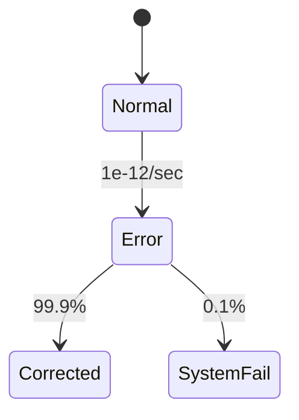

# PRISM 与硬件验证

## 引言

PRISM（Probabilistic Symbolic Model Checker）是一种基于概率模型检测的工具，广泛应用于硬件系统的形式化验证。硬件验证的目标是确保设计满足功能正确性、时序约束和可靠性要求。通过PRISM，我们可以对硬件系统的概率行为（如故障率、功耗分布）进行建模和分析，从而发现潜在的设计缺陷。

:::note 为什么选择PRISM？
- **概率分析**：支持对随机故障、噪声等不确定性的量化评估。
- **自动化验证**：自动检查系统是否满足给定的概率时序逻辑（PCTL）规约。
- **模块化建模**：通过并行组合描述复杂的硬件组件交互。
:::

---

## 硬件验证的核心挑战

硬件系统通常面临以下问题：
1. **并发行为**：多组件并行运行时可能产生竞争条件。
2. **时序约束**：信号传播延迟可能导致时序违规。
3. **随机故障**：制造缺陷或环境噪声引发概率性错误。

PRISM通过以下方式应对这些挑战：
- 使用**马尔可夫模型**（DTMC、CTMC）描述状态转移概率。
- 通过**概率规约**（如`P≥0.99 [ F success ]`）表达可靠性需求。

---

## PRISM 建模示例：缓存一致性协议

以下是一个简化的缓存一致性协议模型，演示如何验证多核处理器中数据一致性的概率保证。

### 模型定义
```prism
// 定义两个处理核心的缓存状态
dtmc

module Core1
    state1: [0..2] init 0; // 0=无效, 1=共享, 2=独占
    [read] state1=0 -> 0.9: state1'=1 + 0.1: state1'=0;
    [write] state1!=2 -> 0.8: state1'=2;
endmodule

module Core2
    state2: [0..2] init 0;
    [read] state2=0 -> 0.9: state2'=1 + 0.1: state2'=0;
    [write] state2!=2 -> 0.8: state2'=2;
endmodule

// 一致性检查：不能同时存在两个独占状态
label "consistent" = !(state1=2 & state2=2);
```

### 验证规约
```prism
// 检查系统在100步内保持一致性的概率
P>=0.95 [ F<=100 "consistent" ]
```

### 输出解析
PRISM会输出：
- 该规约是否被满足。
- 实际概率值（例如`0.982`）。
- 反例路径（如果验证失败）。

---

## 实际案例：DRAM错误检测

### 问题描述
DRAM存储器可能因宇宙射线等环境因素发生位翻转（Bit Flip）。通过PRISM可以量化错误率并设计纠错机制。



### PRISM 模型片段
```prism
ctmc

const double lambda = 1e-12; // 错误发生率
const double mu = 0.999;     // 纠错成功率

module DRAM
    state: [0..1] init 0; // 0=正常, 1=错误
    [] state=0 -> lambda: state'=1;
    [] state=1 -> mu: state'=0 + (1-mu): state'=1; // 自循环表示系统崩溃
endmodule

// 验证10年内系统崩溃概率
P<=1e-6 [ F<=315360000 state=1 ] // 315360000秒=10年
```

---

## 总结与练习

### 关键点总结
1. PRISM可通过概率模型验证硬件设计的可靠性。
2. 常用模型类型：DTMC（离散时间）、CTMC（连续时间）。
3. 规约语言PCTL支持概率及时序约束表达。

### 练习建议
1. 扩展缓存模型到3个核心，验证一致性概率变化。
2. 为DRAM模型添加ECC（纠错码）模块，比较纠错前后的系统可靠性。

### 扩展资源
- PRISM官方文档：[Hardware Verification案例库](http://www.prismmodelchecker.org/casestudies/hardware.php)
- 教材推荐：《Formal Methods for Hardware Verification》by Orna Grumberg