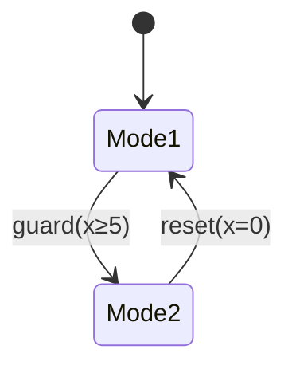

# PRISM 与混合系统验证

## 引言

混合系统（Hybrid Systems）是同时包含离散状态和连续动态行为的复杂系统，常见于嵌入式控制、机器人、物联网等领域。PRISM作为概率符号模型检测器，能够通过扩展的建模语言和分析技术验证混合系统的概率性质。本章将介绍如何用PRISM建模混合系统，并通过案例演示验证流程。

---

## 混合系统基础

混合系统的核心特征包括：
- **离散状态**：如控制模式、开关状态
- **连续变量**：如温度、速度等随时间变化的量
- **交互行为**：离散事件触发连续动态的变化



---

## PRISM 中的混合建模

### 1. 连续变量声明
PRISM使用`clock`关键字定义连续变量：
```prism
// 定义连续变量x（时钟）
clock x;

// 带速率变化的连续变量
module tank
    water : [0,100] init 50;
    [fill] water' = water + 2;
    [drain] water' = water - 1;
endmodule
```

### 2. 混合自动机建模
```prism
module heater
    temp : [0,150] init 20;
    mode : [off,on] init off;

    [tick] mode=off & temp<=18 -> (temp'=temp+0.5) & (mode'=on);
    [tick] mode=on & temp>=22 -> (temp'=temp-0.3) & (mode'=off);
    [tick] mode=on -> (temp'=temp+0.5);
    [tick] mode=off -> (temp'=temp-0.3);
endmodule
```

:::tip 混合系统建模要点
1. 使用`clock`定义连续时钟变量
2. 通过微分方程(`'=`)描述连续变化
3. 用离散转移表示模式切换
:::

---

## 验证案例：温度控制系统

### 系统描述
验证恒温器在10小时内保持温度在18-22℃的概率：

```prism
// 属性规范
P=? [ F<=10 (temp < 18 | temp > 22) ]

// 带概率的混合模型
module thermostat
    temp : [15,25] init 20;
    [tick] temp<=20 -> 0.8:(temp'=temp+0.1) + 0.2:(temp'=temp-0.1);
    [tick] temp>20  -> 0.7:(temp'=temp-0.1) + 0.3:(temp'=temp+0.1);
endmodule
```

### 分析结果
通过PRISM验证可得到概率边界：
```
Result: 0.127 (12.7%违规概率)
```

---

## 工业案例：水箱控制系统

### 系统需求
- 水位保持在40-60升
- 进水阀故障概率5%
- 排水速率随机波动

```prism
module water_tank
    water : [0,100] init 50;
    valve : [0,1] init 1; // 1=working

    [fill] valve=1 & water<60 -> 0.95:(water'=water+5) & (valve'=1)
                              + 0.05:(water'=water) & (valve'=0);
    [fail] valve=0 -> (water'=water-2);
endmodule

// 验证24小时内水位超限的概率
Pmax=? [ F<=24 water>60 | water<40 ]
```

---

## 总结与扩展

### 关键知识点
1. PRISM通过`clock`和微分方程支持混合建模
2. 连续变量需要离散化处理
3. 概率转移可模拟物理不确定性

### 推荐练习
1. 建模汽车巡航控制系统，验证速度保持误差
2. 为电池充电系统添加温度动态，分析过温风险
3. 扩展水箱案例，考虑多故障模式

### 延伸阅读
- PRISM手册"Hybrid Systems"章节
- 《混合系统形式化方法》第三章
- HSCC国际会议最新论文集

:::caution 注意事项
混合系统验证可能面临"状态空间爆炸"问题，建议：
1. 合理设置变量范围
2. 使用抽象技术简化模型
3. 分模块验证复杂系统
:::