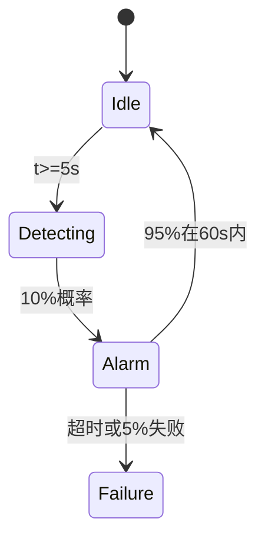

## 引言

实时系统（如交通信号控制、嵌入式系统）需要在严格时间约束下运行，其正确性不仅依赖逻辑结果，还与时间行为密切相关。PRISM通过扩展**概率时间自动机**和**连续时间马尔可夫链**（CTMC）等模型，支持对实时系统的概率行为进行形式化验证。本章将介绍如何用PRISM建模实时系统，并通过案例演示时间相关属性的分析方法。

## 核心概念

### 1. 时间自动机与时钟变量
PRISM使用**时钟变量**（clock variables）模拟时间流逝，其值随时间线性增长，可通过重置（reset）操作归零。时间自动机的状态转移通常包含：
- **时间延迟**：在某个状态下停留一段时间
- **时钟约束**：转移触发的条件（如 `x <= 5`）
- **重置动作**：转移时重置部分时钟

```prism
// 定义时钟变量
clock x; 

// 带时间约束的模块
module Process
    state : [0..2] init 0;
    [act] state=0 & x<=2 -> (state'=1) & (x'=0); // 条件触发并重置时钟
    [time] state=1 -> true; // 允许时间流逝
endmodule
```

### 2. 连续时间模型（CTMC）
对于随机时间行为，CTMC用**指数分布**描述状态停留时间。PRISM中通过速率（rate）定义：

```prism
// 温度控制器CTMC模型
module Heater
    temp : [0..100] init 20;
    [] temp < 30 -> 0.5 : (temp'=temp+1); // 加热速率0.5
    [] temp > 25 -> 1.0 : (temp'=temp-1); // 冷却速率1.0
endmodule
```

## 建模实战：火灾报警系统

### 系统需求
- 烟雾传感器每5秒检测一次，误报概率10%
- 报警触发后，60秒内喷淋系统启动（成功概率95%）
- 整体失效概率需低于0.1%

### PRISM 模型
```prism
// 定义时钟和常量
const int T_CHECK = 5; 
const double P_FALSE_ALARM = 0.1;
const int T_SPRINKLER = 60;

clock t; // 全局时钟

module Sensor
    state : [0..2]; // 0=空闲, 1=检测中, 2=报警
    [] state=0 & t>=T_CHECK -> 
        0.9 : (state'=0) & (t'=0) + 
        0.1 : (state'=2) & (t'=0);
    [] state=2 & t<=T_SPRINKLER -> 0.95 : (state'=0); // 成功响应
    [] state=2 & t>T_SPRINKLER -> true; // 超时失效
endmodule

// 使用CSL验证属性
// "报警后60秒内响应概率"
P>=0.95 [ F<=60 state=0 | state=2 ]
```

### 验证结果分析
通过PRISM计算：
- 最大响应概率：`0.957`（满足需求）
- 最坏情况下失效概率：`0.043`



## 高级主题：混合自动机
对于既有离散事件又有连续动态的系统（如电池充放电），PRISM支持**混合自动机**建模：

```prism
// 电池电压连续变化
module Battery
    v : [0..5] init 4; // 电压
    mode : [0..1]; // 0=放电, 1=充电
    [discharge] mode=0 -> (v'=v-0.1*dv);
    [charge] mode=1 -> (v'=v+0.2*dv);
    // 电压变化率依赖时间微分dv
endmodule
```

## 总结与练习

### 关键点总结
1. 时钟变量用于捕获实时系统中的时间约束
2. CTMC适合建模随机时间行为
3. 混合自动机可处理连续-离散混合动态

### 巩固练习
1. 修改火灾报警模型，使传感器检测间隔变为随机指数分布（λ=0.2）
2. 为电池模型添加属性："电压在3V以下时，1小时内充满电的概率"
3. 设计一个交通灯控制器模型，要求绿灯持续时间在45-60秒之间

### 扩展阅读
- PRISM手册第7章 "Real-time and hybrid systems"
- 教材《Principles of Model Checking》第18章（时间自动机）
- UPPAAL工具对比研究（时间建模替代方案）