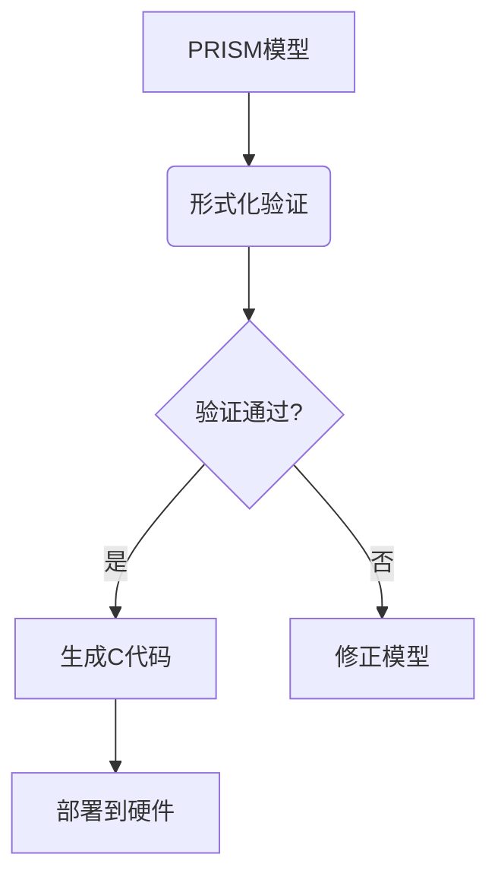

# PRISM 与代码生成

## 介绍

PRISM（Probabilistic Symbolic Model Checker）是一个广泛使用的概率模型检测工具，主要用于分析随机系统的行为。**代码生成**功能允许用户将验证后的PRISM模型转换为实际编程语言（如C、Java等）的可执行代码，从而搭建原型系统或嵌入现有项目。本章将介绍PRISM代码生成的核心概念、操作流程和实际应用场景。

## 代码生成基础

### 为什么需要代码生成？
1. **从模型到实现**：验证后的模型需要转化为实际可运行的代码
2. **保持一致性**：确保实现与形式化模型严格对应
3. **快速原型开发**：跳过手动编码阶段，减少错误

### 支持的语言
PRISM支持生成以下语言的代码：
- C
- Java
- MATLAB
- Python（通过第三方扩展）

## 生成代码步骤

### 1. 准备PRISM模型
首先需要一个已验证的PRISM模型文件（`.prism`扩展名）。以下是一个简单的DTMC（离散时间马尔可夫链）示例：

```prism
// 文件名: simple_dtmc.prism
dtmc

module Main
  x : [0..2] init 0;
  
  [] x=0 -> 0.5:(x'=1) + 0.5:(x'=2);
  [] x=1 -> 1:(x'=0);
  [] x=2 -> 1:(x'=0);
endmodule
```

### 2. 执行代码生成命令
在PRISM命令行界面中使用`-export`参数：

```bash
prism simple_dtmc.prism -exportmodel simple_dtmc.java
```

### 3. 输出文件结构
生成的Java代码通常包含：
- 状态转换逻辑
- 概率分布实现
- 可扩展的框架结构

## 代码示例解析

以下是一个生成的Java代码片段示例：

```java
// 生成的代码片段
public class SimpleDTMC {
    private int x;
    
    public void step() {
        double r = Math.random();
        if (x == 0) {
            if (r < 0.5) x = 1;
            else x = 2;
        }
        else if (x == 1 || x == 2) {
            x = 0;
        }
    }
}
```

:::note
生成的代码会严格保持原始模型的概率语义，但可能需要手动添加I/O接口才能与外部系统交互。
:::

## 实际应用案例

### 案例：网络协议实现
1. **场景**：验证一个无线传感器网络的路由协议
2. **步骤**：
   - 在PRISM中建模协议的概率行为
   - 验证关键属性（如数据包到达概率）
   - 生成C代码部署到实际传感器节点



## 高级功能

### 自定义模板
PRISM允许使用模板文件控制代码生成格式：

```
// 模板示例（template.c）
void update() {
    {{TRANSITIONS}}
}

int main() {
    {{INIT}}
    while(1) {
        update();
    }
}
```

### 参数化生成
通过命令行参数控制生成选项：

```bash
prism model.prism -exportmodel output.java -javapackage com.example
```

## 注意事项

:::caution
1. **状态爆炸问题**：大规模模型生成的代码可能效率低下
2. **人工优化**：生成的代码通常需要性能优化
3. **平台限制**：某些概率分布在不同语言中的实现可能不同
:::

## 总结与练习

### 关键点总结
- PRISM代码生成桥接了形式化模型与实际实现
- 支持多种主流编程语言
- 生成代码需要二次开发才能完全实用

### 练习建议
1. 尝试将本章的DTMC示例生成Java和C代码，比较差异
2. 为生成的代码添加日志功能，记录状态转移历史
3. 修改模板文件，生成适合嵌入式系统的精简代码

### 扩展阅读
- PRISM官方文档中的"Code Generation"章节
- 《形式化方法到代码的自动转换》学术论文
- ROS（机器人操作系统）与PRISM的集成案例