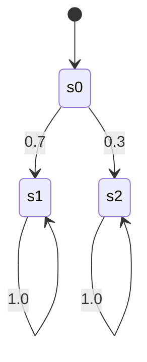

# PRISM 与规范生成

## 引言

在形式化方法中，**规范生成**（Specification Generation）是指从系统模型自动推导出满足特定性质的形式化规范的过程。PRISM作为概率模型检测工具，不仅支持验证已有规范，还能通过分析模型结构生成潜在的规范模板。本章将介绍PRISM中规范生成的基本概念、语法和实际案例。

:::note 为什么需要规范生成？
- 帮助初学者快速理解模型的关键性质
- 避免人工编写规范时的遗漏或错误
- 发现模型中可能被忽视的重要属性
:::

## 基础概念

### 1. 什么是规范生成？

在PRISM中，规范生成通常指：
1. 自动推导模型的**可达性属性**（哪些状态可达）
2. 识别**概率边界**（最大/最小概率达到某些状态）
3. 生成**时序逻辑公式**（如PCTL、CSL）

### 2. PRISM中的规范类型

PRISM支持以下规范生成模式：
```prism
// 概率可达性
P=? [ F "target" ]

// 期望值计算
R=? [ F "completed" ]

// 稳态概率
S=? [ "queue_full" ]
```

## 规范生成实战

### 案例1：简单DTMC模型

考虑一个三状态离散时间马尔可夫链：



对应的PRISM模型：
```prism
dtmc

module Simple
    s : [0..2] init 0;
    
    [] s=0 -> 0.7:(s'=1) + 0.3:(s'=2);
    [] s=1 -> 1.0:(s'=1);
    [] s=2 -> 1.0:(s'=2);
endmodule
```

**自动生成的规范建议**：
1. 从初始状态到达吸收状态s1的概率：
   ```prism
   P=? [ F s=1 ]
   ```
2. 系统永远停留在s0的概率：
   ```prism
   P=? [ G s=0 ]
   ```

### 案例2：通信协议验证

考虑一个重传协议模型，我们可以生成以下实用规范：

```prism
// 消息最终传递成功的概率
P>=0.99 [ F delivered ]

// 平均重传次数期望
R{"retries"}=? [ F success ]

// 缓冲区溢出的稳态概率
S=? [ buffer=MAX ]
```

## 高级技巧

### 1. 参数化规范生成

使用PRISM的常量定义功能实现通用规范模板：

```prism
const int K;

// 检查K步内完成的概率
P=? [ F<=K completed ]
```

### 2. 多目标优化

组合多个规范进行Pareto最优分析：
```prism
multi(P<=0.1 [ F error ], R{"cost"}=? [ F completed ])
```

## 实际应用场景

### 网络协议分析
- 生成"数据包在3次重传内成功传递"的概率规范
- 自动生成吞吐量期望公式

### 机器人路径规划
- 生成"避开障碍物到达目标"的最小概率要求
- 能量消耗的期望值计算

## 总结

| 关键点                  | 说明                          |
|-------------------------|-------------------------------|
| 自动生成规范类型        | 概率可达性、期望值、稳态概率  |
| 常用运算符              | `P=?`, `R=?`, `S=?`           |
| 典型应用领域            | 协议验证、性能分析、安全评估  |

## 延伸学习

推荐练习：
1. 为简单的队列模型生成以下规范：
   - 队列长度超过5的稳态概率
   - 请求在10步内被处理的概率

附加资源：
- PRISM官方文档中的"Property Specification"章节
- 《Principles of Model Checking》第10章

:::tip 实践建议
在PRISM GUI中使用"New Property"向导时，观察工具自动建议的规范模板，这是学习规范生成的良好起点。
:::