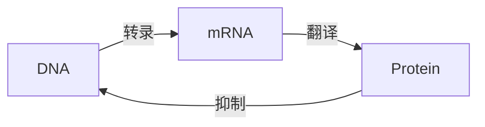

# PRISM 生物化学网络建模

## 引言

生物化学网络是研究细胞内部分子相互作用的核心工具，涉及基因调控、代谢通路和信号转导等复杂过程。PRISM作为概率符号模型检测器，能够对这些网络的随机行为进行**定量分析**，例如计算特定分子浓度达到阈值的时间概率。本节将通过案例展示如何用PRISM建模典型生化反应，并分析其动态特性。

## 基础概念

### 1. 生物化学网络的PRISM表示
生物化学系统通常被抽象为：
- **物种（Species）**：如蛋白质、mRNA等分子
- **反应（Reactions）**：遵循质量作用定律的随机过程

在PRISM中，这些元素被转化为：
- **离散变量**：表示分子数量
- **概率转移**：描述反应发生的速率

### 2. 关键建模组件
```prism
// 定义分子类型
const int MAX = 100;  // 系统容量
species A = 50 init;  // 初始浓度50
species B = 0 init;

// 定义反应速率常数
const double k1 = 0.1;
const double k2 = 0.05;
```

## 案例研究：蛋白质二聚化

### 模型构建
考虑蛋白质单体（`P`）结合形成二聚体（`P2`）的反应：
$$
2P \xrightarrow{k_1} P2 \\
P2 \xrightarrow{k_2} 2P
```

对应的PRISM模型：
```prism
// 二聚化反应模型
dtmc

const int MAX_P = 100;
const double k1 = 0.01;
const double k2 = 0.2;

module dimerization
    P : [0..MAX_P] init 50;  // 初始50个单体
    P2 : [0..MAX_P/2] init 0;

    // 结合反应：速率=k1*P*(P-1)/2 (组合数计算)
    [] P >= 2 -> k1*P*(P-1)/2 : (P'=P-2) & (P2'=P2+1);

    // 解离反应：速率=k2*P2
    [] P2 >= 1 -> k2*P2 : (P'=P+2) & (P2'=P2-1);
endmodule
```

### 性质验证
通过PCTL公式验证系统行为：
```prism
// 计算10分钟内形成至少20个二聚体的概率
P=? [ F<=600 P2 >= 20 ]

// 稳态时单体数量的期望值
S=? [ P ]
```

:::tip 速率常数注意
生物化学反应速率常数的单位需要统一：
- 二阶反应（如结合）：$M^{-1}s^{-1}$
- 一阶反应（如解离）：$s^{-1}$
:::

## 高级案例：基因调控网络

### 负反馈环路建模


对应的PRISM模块：
```prism
ctmc

const double k_transcription = 0.5;
const double k_translation = 0.1;
const double k_degradation = 0.05;
const double k_inhibition = 0.01;

module gene_network
    dna : bool init true;  // 基因活性状态
    mrna : [0..1000] init 0;
    protein : [0..10000] init 0;

    // 转录（受蛋白抑制）
    [transcribe] dna & protein < 500 -> k_transcription : mrna' = mrna + 1;

    // 翻译
    [translate] mrna > 0 -> mrna*k_translation : protein' = protein + 1;

    // mRNA降解
    [degrade_mRNA] mrna > 0 -> mrna*k_degradation : mrna' = mrna - 1;

    // 蛋白降解
    [degrade_protein] protein > 0 -> protein*k_degradation : protein' = protein - 1;

    // 负反馈（蛋白浓度高时关闭基因）
    [inhibit] protein >= 500 -> k_inhibition*protein : dna' = false;
    [activate] protein < 300 & !dna -> k_inhibition : dna' = true;
endmodule
```

### 振荡行为分析
验证系统是否表现出振荡：
```prism
// 检查蛋白浓度是否在200-800之间周期性变化
P>=0.95 [ G F protein>800 & F protein<200 ]
```

:::caution 状态空间爆炸
生物化学网络模型容易产生大规模状态空间：
- 使用PRISM的**近似计算**功能
- 对物种数量设置合理上限
- 考虑模块化分解技术
:::

## 总结与拓展

### 关键收获
1. PRISM可将生物化学反应转化为离散状态模型
2. 通过速率常数控制反应概率
3. 能验证稳态/瞬态性质

### 推荐练习
1. 修改二聚化模型，加入降解反应
2. 在基因网络中实现正反馈
3. 使用PRISM的**参数合成**功能找出产生振荡的速率常数范围

### 延伸阅读
- PRISM官方生物模型案例库
- 《Systems Biology: Simulation of Dynamic Network States》
- 随机生化反应的Gillespie算法

通过本章学习，您已掌握用PRISM分析生物化学网络的核心方法。接下来可尝试将技术应用于您研究领域的具体问题。