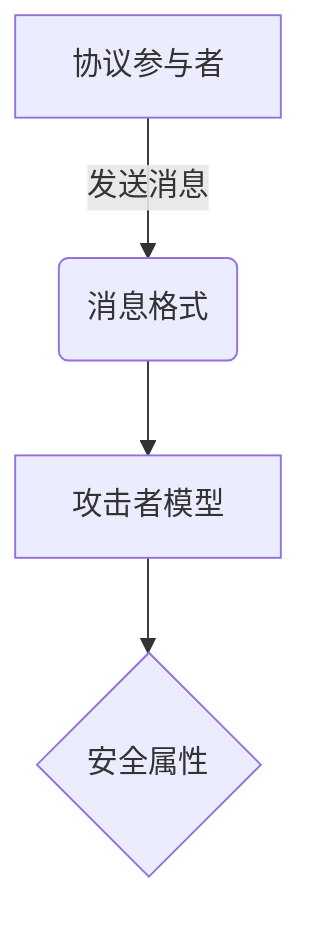
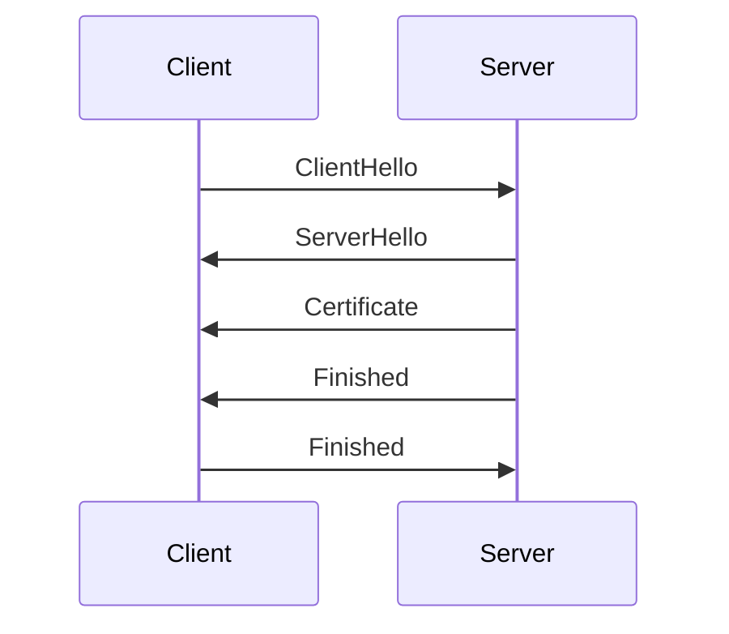

# PRISM 安全协议分析

## 引言
安全协议是保障网络通信安全的核心机制，如TLS、SSH等。但这些协议的正确性往往难以通过传统测试验证。PRISM作为**概率符号模型检测器**，能够对安全协议进行形式化建模，并通过数学方法验证其保密性、完整性和可用性等属性。本章将介绍如何用PRISM分析典型安全协议，并展示完整工作流程。

## 基础概念
### 安全协议的关键特性
1. **保密性**：攻击者无法获取敏感信息
2. **认证性**：通信双方能确认彼此身份
3. **新鲜性**：防止重放攻击
4. **前向安全性**：长期密钥泄露不影响历史通信

### PRISM 建模要素


## 案例研究：Needham-Schroeder协议
### 协议描述
经典的认证协议，包含7个步骤的消息交换。我们将重点关注其对称密钥版本。

### PRISM 建模
```prism
// 定义常量
const int N; // 随机数范围
const double p_loss; // 消息丢失概率

// 参与者模块
module Initiator
    nonce_a : [0..N] init 0;
    [send1] true -> (nonce_a'=uniform(1..N));
    [recv2] nonce_a > 0 -> 0.9: (nonce_a'=0) + 0.1: true;
endmodule

module Responder
    nonce_b : [0..N] init 0;
    [recv1] true -> (nonce_b'=uniform(1..N));
    [send2] nonce_b > 0 -> 0.9: (nonce_b'=0) + 0.1: true;
endmodule
```

### 攻击者模型
:::note
我们使用Dolev-Yao模型，假设攻击者可以：
- 拦截所有网络消息
- 解密已破解密钥的消息
- 注入伪造消息
:::

```prism
// 攻击者知识库
formula knows_msg1 = (initiator.nonce_a > 0);
formula knows_msg2 = (responder.nonce_b > 0);
```

### 安全属性验证
验证认证性属性：
```prism
P>=0.99 [ F (initiator.nonce_a=0 & responder.nonce_b=0) ]
```

验证保密性属性：
```prism
P<=0.01 [ F knows_msg1 & knows_msg2 ]
```

## 实际应用：TLS 1.3简化分析
### 握手阶段建模


### 关键PRISM属性
```prism
// 前向安全性
P>=0.999 [ G (leak_longterm_key => !F reveals_past_data) ]

// 会话密钥保密性
P<=0.001 [ F (attacker_knows_session_key) ]
```

## 常见问题解决
:::caution
**状态爆炸问题**处理技巧：
1. 使用对称性归约
2. 应用抽象技术
3. 限制随机数范围
4. 分阶段验证
:::

## 总结与练习
### 关键要点
- PRISM可形式化验证安全协议的概率属性
- 需要准确定义参与者、消息空间和攻击者能力
- 组合使用PCTL和LTL公式表达安全需求

### 进阶练习
1. 扩展Needham-Schroeder模型，增加密钥更新机制
2. 为TLS 1.3添加0-RTT（零往返时间）模式分析
3. 比较不同攻击者模型的验证结果差异

### 扩展资源
- 《Security Protocol Verification: Symbolic and Computational Models》
- PRISM官方案例库中的"Security Protocols"部分
- CSP/FDR与PRISM的对比分析方法