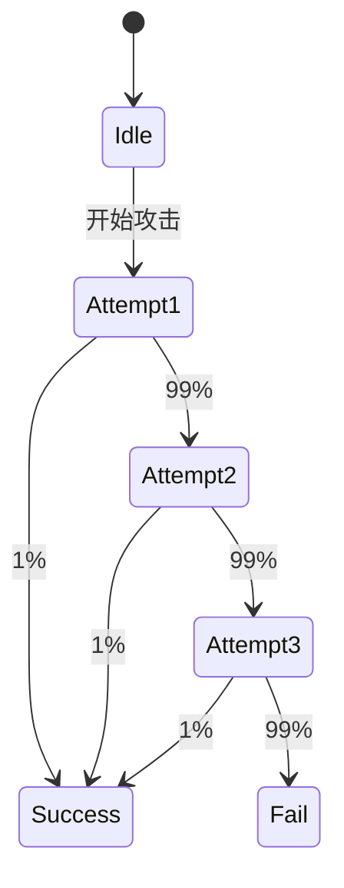

# PRISM 网络攻击分析

## 引言

网络攻击分析是网络安全领域的关键环节，而**PRISM**作为概率符号模型检测工具，能够对攻击行为进行形式化建模和定量验证。本章将通过实际案例展示如何用PRISM分析攻击者渗透系统的概率、时间成本以及防御策略的有效性。

:::note 为什么选择PRISM？
- **概率建模**：处理不确定性和随机行为（如攻击尝试成功率）
- **自动化验证**：计算"攻击者在3次尝试内成功入侵的概率"等属性
- **场景扩展**：轻松调整模型参数（如防火墙规则变化）
:::

---

## 基础概念

### 1. 攻击者模型
在PRISM中，攻击者通常被建模为**马尔可夫决策过程(MDP)** 或**连续时间马尔可夫链(CTMC)**：
```prism
// 简单攻击者行为示例（MDP）
module Attacker
    state : [0..3] init 0;  // 0=准备, 1=扫描, 2=渗透尝试, 3=成功
    [scan] state=0 -> 0.9:(state'=1) + 0.1:(state'=0);
    [exploit] state=1 -> 0.7:(state'=2) + 0.3:(state'=1);
    [breach] state=2 -> 0.2:(state'=3) + 0.8:(state'=0);
endmodule
```

### 2. 安全属性
通过PCTL（概率计算树逻辑）表达安全需求：
- `P>=0.95 [ F<=10 state=3 ]`："10步内入侵成功概率≥95%"
- `R{"cost"}<=5 [ F state=3 ]`："成功入侵的期望成本≤5"

---

## 案例研究：SSH暴力破解分析

### 模型构建
```prism
// SSH暴力破解模型（DTMC）
const int MAX_ATTEMPTS = 3;
const double SUCCESS_RATE = 0.01;  // 单次尝试成功率

module SSH_Attack
    attempts : [0..MAX_ATTEMPTS] init 0;
    compromised : bool init false;

    [attempt] !compromised & attempts<MAX_ATTEMPTS -> 
        SUCCESS_RATE : (compromised'=true) + 
        (1-SUCCESS_RATE) : (attempts'=attempts+1);
endmodule

rewards "time_cost"
    [attempt] 1 : true;
endrewards
```

### 验证查询
1. **成功概率**：
   ```prism
   P=? [ F<=MAX_ATTEMPTS compromised ]
   // 输出：0.0297 (约3%)
   ```
2. **期望时间成本**：
   ```prism
   R{"time_cost"}<=? [ F compromised ]
   // 输出：2.94 (平均需要2.94次尝试)
   ```



---

## 防御策略评估

### 添加账户锁定机制
```prism
module Defense
    locked : bool init false;
    [attempt] attempts=2 -> (locked'=true);
endmodule

// 更新后的成功概率查询
P=? [ F<=MAX_ATTEMPTS compromised | locked=false ]
// 输出：0.0199 (降低至约2%)
```

:::warning 注意
实际模型中需考虑：
- 锁定持续时间
- 攻击者IP变更的可能性
- 误锁合法用户的风险
:::

---

## 总结与练习

### 关键收获
1. PRISM可将攻击流程转化为状态转移模型
2. 通过概率验证量化攻击风险
3. 能对比不同防御策略的效果

### 扩展练习
1. 修改SSH模型，增加5次失败后永久锁定的规则
2. 创建一个包含2个防御层的模型（如防火墙+入侵检测）
3. 计算攻击者在1小时内成功的最大概率

### 推荐资源
- PRISM官方案例库中的`firewire.nm`案例
- 《Security and Probability》第4章（Baier/Katoen著）