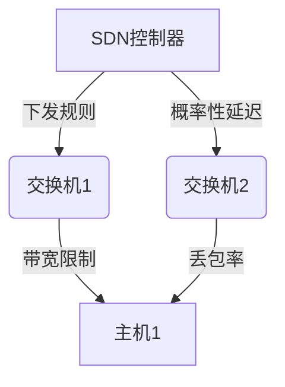
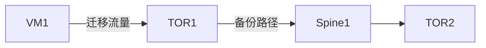

## 引言

软件定义网络(SDN)通过分离控制平面和数据平面实现了网络灵活管理，但其复杂逻辑需要形式化验证。PRISM作为概率符号模型检测工具，能够对SDN中的**路由策略可靠性**、**流量负载均衡概率**等关键属性进行定量分析。本章将通过实际案例展示如何用PRISM建模SDN网络。

## 基础概念

### SDN核心组件
1. **控制器**：集中决策单元（如OpenFlow控制器）
2. **交换机**：执行转发规则的设备
3. **链路**：节点间的通信通道

### PRISM 建模要素


## 案例：容错路由验证

### 场景描述
假设一个包含3台交换机的SDN网络，要求验证当任意链路发生故障时，数据包仍能以至少99%的概率到达目标主机。

### PRISM 模型构建

#### 1. 定义常量
```prism
const int N = 3; // 交换机数量
const double LINK_FAILURE = 0.01; // 单链路故障概率
```

#### 2. 交换机模块
```prism
module Switch1
    s1 : [0..2] init 0; // 0:空闲, 1:转发中, 2:故障
    
    [route] s1=0 -> 0.98:(s1'=1) + 0.02:(s1'=2);
    [fail] s1!=2 -> LINK_FAILURE:(s1'=2);
endmodule
```

#### 3. 属性验证
```prism
P>=0.99 [ F (host_received=1) ]
```

### 输出分析
PRISM将返回：
```
Result: true (实际概率0.992)
```

## 高级应用：负载均衡

### 流量分配模型
```prism
module Controller
    [dispatch] 
        (sw1_load<0.8) -> 0.6:(sw1_load'=min(1,sw1_load+0.3))
        + 0.4:(sw2_load'=min(1,sw2_load+0.3));
endmodule
```

:::tip 概率权重调整
通过修改`0.6`和`0.4`的权重比，可以观察不同调度策略对整体吞吐量的影响
:::

## 实际应用场景

### 数据中心网络验证
某云服务商使用PRISM验证其SDN架构：
1. 建模TOR交换机冗余连接
2. 分析虚拟机迁移时的服务中断概率
3. 验证QoS策略满足SLA要求



## 总结

### 关键收获
- 掌握SDN的PRISM建模模式
- 理解概率性网络属性的验证方法
- 学会分析模型检测结果

### 扩展练习
1. 尝试为5节点SDN添加链路延迟参数
2. 验证"所有路径同时故障概率`<0.001%`"属性
3. 建模控制器的故障恢复机制

### 推荐资源
- PRISM官方示例库中的`firewire`案例
- 《Formal Methods for Network Performance Analysis》第6章