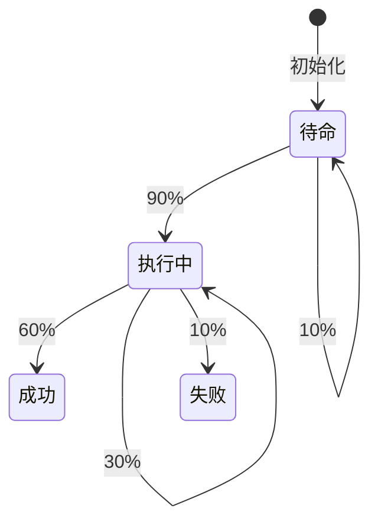

## 引言

PRISM（Probabilistic Symbolic Model Checker）是用于分析概率系统的形式化验证工具。在军事领域，PRISM可用于建模**武器系统可靠性**、**通信协议安全性**或**任务规划成功率**等关键场景。本章将通过案例展示如何用PRISM描述军事系统中的不确定性。

## 基础概念

军事系统建模通常涉及以下PRISM特性：
- **离散/连续时间马尔可夫链（DTMC/CTMC）**：描述系统状态转移概率
- **概率时序逻辑（PCTL/CSL）**：定义系统需满足的规约
- **代价/奖励（Rewards）**：量化资源消耗或任务成功率

## 案例1：无人机侦察任务可靠性

### 系统描述
假设无人机执行侦察任务时有：
- 60%概率正常完成
- 30%概率遭遇干扰需重试
- 10%概率彻底失败

### PRISM 模型代码
```prism
// 无人机状态定义
dtmc

module Drone
    state : [0..3] init 0; // 0:待命, 1:执行中, 2:成功, 3:失败

    [launch] state=0 -> 0.9 : (state'=1) + 0.1 : (state'=0); // 10%发射失败
    [mission] state=1 -> 0.6 : (state'=2) + 0.3 : (state'=1) + 0.1 : (state'=3);
endmodule

// 属性验证：任务最终成功率
P=? [ F state=2 ]
```

### 输出分析
PRISM计算结果为 `0.857`（约85.7%最终成功率），通过以下Mermaid状态图可直观理解：



:::tip 军事建模要点
1. 故障概率需参考真实装备参数
2. 通过`rewards`可量化燃油消耗等成本
3. 使用`multi-objective`验证复杂指标
:::

## 案例2：装甲编队协同作战

### 场景描述
3辆坦克通过无线电协同攻击，要求验证：
- 至少2辆存活时完成任务概率
- 平均被击毁数量

```prism
ctmc

const int N = 3; // 坦克数量
module Tank[i=1..N]
    alive : bool init true;
    // 每辆坦克每小时有15%被击毁概率
    [] alive -> 0.15 : (alive'=false);
endmodule

// 属性定义
P>=0.9 [ F<=2 (sum(i=1..N)(alive)>=2 ] // 2小时内维持战力的概率
R{"destroyed"}=? [ C<=2 ]              // 2小时内平均损失
```

### 关键输出
- 2小时维持战力的概率：`0.927`
- 平均损失坦克数：`0.45`辆

:::note 军事决策支持
此类分析可帮助指挥官在以下方面做出决策：
- 最优编队规模
- 任务时间窗口选择
- 备用单位调度策略
:::

## 高级应用：电子对抗模拟

### 干扰通信系统模型
```prism
// 使用CTMC模拟通信干扰
module CommSystem
    status : [0..2]; // 0:正常, 1:降级, 2:中断
    [] status=0 -> 0.1 : (status'=1) + 0.02 : (status'=2);
    [] status=1 -> 0.3 : (status'=0) + 0.05 : (status'=2);
    [recover] status=2 -> 0.5 : (status'=0); // 人工恢复
endmodule

rewards "uptime"
    [recover] true : 10; // 恢复操作成本
endrewards
```

## 总结与练习

### 核心收获
1. PRISM可量化军事系统中的概率性事件
2. 通过模型检测发现潜在脆弱环节
3. 多维度评估系统效能（概率、成本、时间）

### 推荐练习
1. 修改无人机案例，增加燃油耗尽概率
2. 为装甲编队添加维修单位模块
3. 计算电子对抗中累计通信中断时间

### 扩展资源
- PRISM官方军事案例库
- 《形式化方法在国防系统中的应用》白皮书
- NATO STANAG 4671可靠性建模标准
